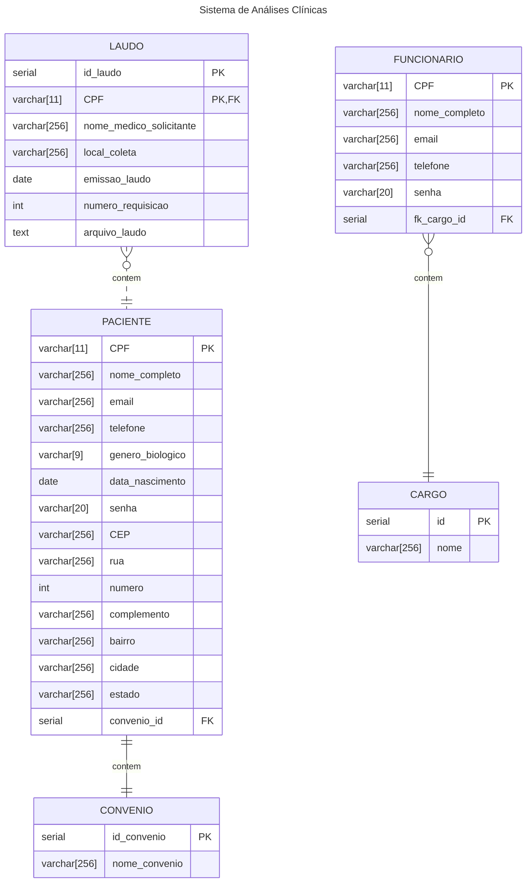

# DIAGRAMA DE ENTIDADE E RELACIONAMENTO

```mermaid
---
title: Sistema de Análises Clínicas
---
erDiagram

PACIENTE only one -- only one CONVENIO : contem
PACIENTE {
    varchar[11] CPF PK
    varchar[256] nome_completo
    varchar[256] email
    varchar[256] telefone
    varchar[9] genero_biologico
    date data_nascimento
    varchar[20] senha
    varchar[256] CEP
    varchar[256] rua
    int numero
    varchar[256] complemento
    varchar[256] bairro
    varchar[256] cidade
    varchar[256] estado
    serial convenio_id FK
}

CONVENIO {
    serial id_convenio PK
    varchar[256] nome_convenio
}

LAUDO zero or many .. only one PACIENTE : contem
LAUDO {
    serial id_laudo PK
    varchar[11] CPF PK,FK
    varchar[256] nome_medico_solicitante
    varchar[256] local_coleta
    date emissao_laudo
    int numero_requisicao
    text arquivo_laudo
    
}

FUNCIONARIO zero or many -- only one CARGO : contem
FUNCIONARIO {
    varchar[11] CPF PK
    varchar[256] nome_completo
    varchar[256] email
    varchar[256] telefone
    varchar[20] senha
    serial fk_cargo_id FK
}

CARGO {
    serial id PK
    varchar[256] nome
}

```

---

[Voltar](readme.md)
