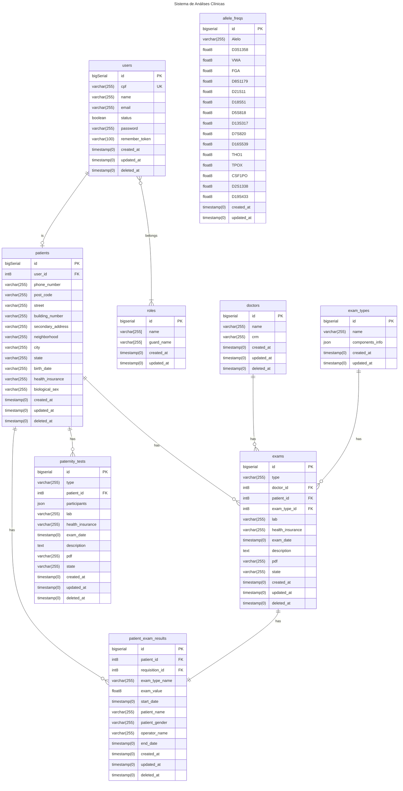

# DIAGRAMA DE ENTIDADE E RELACIONAMENTO

```mermaid
---
title: Sistema de Análises Clínicas
---
erDiagram

users only one -- zero or one patients : is
users zero or many -- one or many roles : belongs
patients only one -- zero or many exams : has
patients only one -- zero or many paternity_tests : has
patients only one -- zero or many patient_exam_results: has
doctors only one -- zero or many exams : has
exam_types only one -- zero or many exams: has
exams only one -- only one patient_exam_results: has


users {
    bigSerial id PK
    varchar(255) cpf UK
    varchar(255) name
    varchar(255) email
    boolean status
    varchar(255) password
    varchar(100) remember_token
    timestamp(0) created_at
    timestamp(0) updated_at
    timestamp(0) deleted_at
}

patients {
    bigSerial id PK
    int8 user_id FK
    varchar(255) phone_number
    varchar(255) post_code
    varchar(255) street
    varchar(255) building_number
    varchar(255) secondary_address
    varchar(255) neighborhood
    varchar(255) city
    varchar(255) state
    varchar(255) birth_date
    varchar(255) health_insurance
    varchar(255) biological_sex
    timestamp(0) created_at
    timestamp(0) updated_at
    timestamp(0) deleted_at

}

doctors {
    bigserial id PK
    varchar(255) name
    varchar(255) crm
    timestamp(0) created_at
    timestamp(0) updated_at
    timestamp(0) deleted_at
}

roles {
    bigserial id PK
    varchar[255] name
    varchar[255] guard_name
    timestamp(0) created_at
    timestamp(0) updated_at

}

exams {
    bigserial id PK
    varchar(255) type
    int8 doctor_id FK
    int8 patient_id FK
    int8 exam_type_id FK
    varchar(255) lab
    varchar(255) health_insurance
    timestamp(0) exam_date
    text description
    varchar(255) pdf
    varchar(255) state
    timestamp(0) created_at
    timestamp(0) updated_at
    timestamp(0) deleted_at
}

exam_types {
    bigserial id PK
    varchar(255) name
    json components_info
    timestamp(0) created_at
    timestamp(0) updated_at
}

paternity_tests {
    bigserial id PK
    varchar(255) type
    int8 patient_id FK
    json participants
    varchar(255) lab
    varchar(255) health_insurance
    timestamp(0) exam_date
    text description
    varchar(255) pdf
    varchar(255) state
    timestamp(0) created_at
    timestamp(0) updated_at
    timestamp(0) deleted_at
}

patient_exam_results {
    bigserial id PK
    int8 patient_id FK
    int8 requisition_id FK
    varchar(255) exam_type_name
    float8 exam_value
    timestamp(0) start_date
    varchar(255) patient_name
    varchar(255) patient_gender
    varchar(255) operator_name
    timestamp(0) end_date
    timestamp(0) created_at
    timestamp(0) updated_at
    timestamp(0) deleted_at
}

allele_freqs {
    bigserial id PK
    varchar(255) Alelo
    float8 D3S1358
    float8 VWA
    float8 FGA
    float8 D8S1179
    float8 D21S11
    float8 D18S51
    float8 D5S818
    float8 D13S317
    float8 D7S820
    float8 D16S539
    float8 THO1
    float8 TPOX
    float8 CSF1PO
    float8 D2S1338
    float8 D19S433
    timestamp(0) created_at
    timestamp(0) updated_at
}

```

---

[Voltar](README.md)
