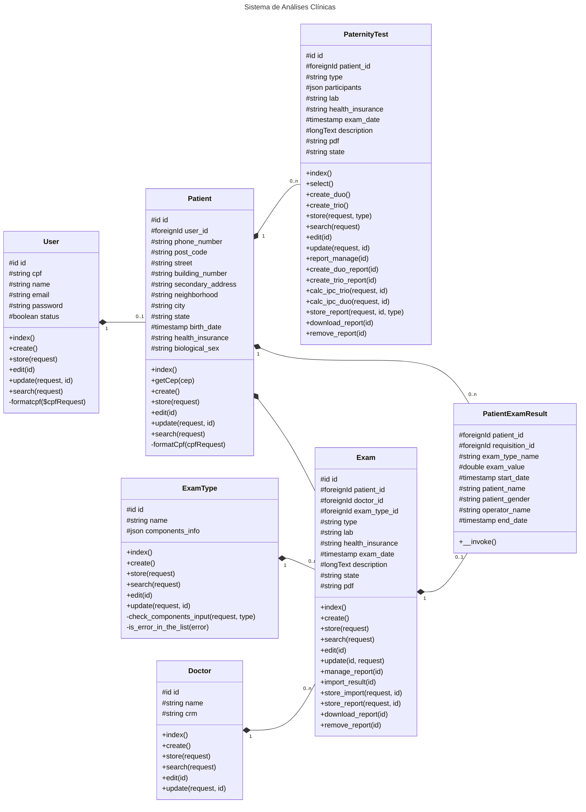

# DIAGRAMA DE CLASSES

```mermaid
---
title: Sistema de Análises Clínicas
---
classDiagram

direction LR


User "1" *-- "0..1" Patient

Patient "1" *-- "0..n" PaternityTest

Patient "1" *-- "0..n" Exam

Patient "1" *-- "0..n" PatientExamResult

ExamType "1" *-- "0..n" Exam

Doctor "1" *-- "0..n" Exam

Exam "1" *-- "0..1" PatientExamResult

class User {
    #id id
    #string cpf 
    #string name
    #string email
    #string password
    #boolean status
    +index()
    +create()
    +store(request)
    +edit(id)
    +update(request, id)
    +search(request)
    -formatcpf($cpfRequest)
}

class Patient{
    #id id
    #foreignId user_id
    #string phone_number
    #string post_code
    #string street
    #string building_number
    #string secondary_address
    #string neighborhood
    #string city
    #string state
    #timestamp birth_date
    #string health_insurance
    #string biological_sex
    +index()
    +getCep(cep)
    +create()
    +store(request)
    +edit(id)
    +update(request, id)
    +search(request)
    -formatCpf(cpfRequest)
}

class Exam {
    #id id
    #foreignId patient_id
    #foreignId doctor_id
    #foreignId exam_type_id
    #string type
    #string lab
    #string health_insurance
    #timestamp exam_date
    #longText description
    #string state
    #string pdf
    +index()
    +create()
    +store(request)
    +search(request)
    +edit(id)
    +update(id, request)
    +manage_report(id)
    +import_result(id)
    +store_import(request, id)
    +store_report(request, id)
    +download_report(id)
    +remove_report(id)

}

class Doctor {
    #id id
    #string name
    #string crm
    +index()
    +create()
    +store(request)
    +search(request)
    +edit(id)
    +update(request, id)
}

class ExamType {
    #id id
    #string name
    #json components_info
    +index()
    +create()
    +store(request)
    +search(request)
    +edit(id)
    +update(request, id)
    -check_components_input(request, type)
    -is_error_in_the_list(error)
}

class PaternityTest {
    #id id
    #foreignId patient_id
    #string type
    #json participants
    #string lab
    #string health_insurance
    #timestamp exam_date
    #longText description
    #string pdf
    #string state
    +index()
    +select()
    +create_duo()
    +create_trio()
    +store(request, type)
    +search(request)
    +edit(id)
    +update(request, id)
    +report_manage(id)
    +create_duo_report(id)
    +create_trio_report(id)
    +calc_ipc_trio(request, id)
    +calc_ipc_duo(request, id)
    +store_report(request, id, type)
    +download_report(id)
    +remove_report(id)
}

class PatientExamResult {
    #foreignId patient_id
    #foreignId requisition_id
    #string exam_type_name
    #double exam_value
    #timestamp start_date
    #string patient_name
    #string patient_gender
    #string operator_name
    #timestamp end_date
    +__invoke()
}


```

---

[Voltar](README.md)
