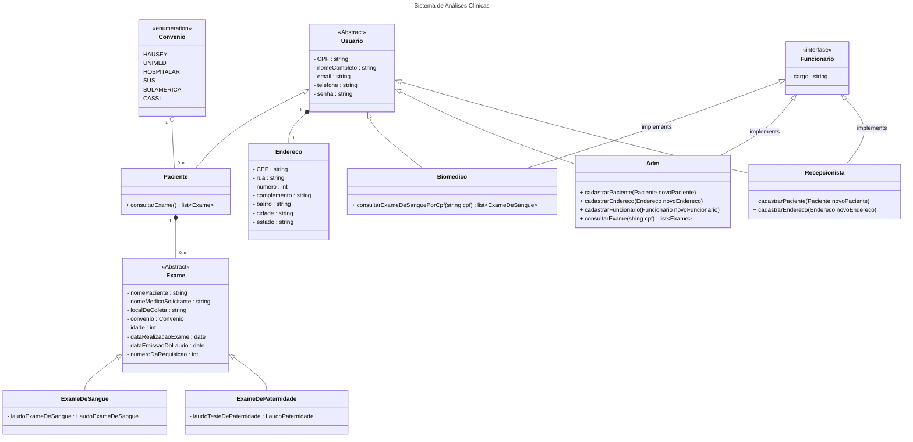

# DIAGRAMA DE CLASSES

```mermaid
---
title: Sistema de Análises Clínicas
---
classDiagram
    Usuario <|-- Paciente
    Convenio "1" o-- "0..n" Paciente
    Paciente "1" *-- "0..n" Exame
    Usuario "1" *-- "1" Endereco
    Usuario <|-- Biomedico
    Funcionario <|-- Biomedico : implements
    Usuario <|-- Adm
    Funcionario <|-- Adm : implements
    Usuario <|-- Recepcionista
    Funcionario <|-- Recepcionista : implements
    Exame <|-- ExameDeSangue
    Exame <|-- ExameDePaternidade

    class Usuario {
        <<Abstract>>
        
        - CPF : string
        - nomeCompleto : string
        - email : string
        - telefone : string
        - senha : string

    }

    class Paciente { 
        + consultarExame() list~Exame~
    }

    class Funcionario {
        <<interface>>

        - cargo : string
    }

    class Biomedico {
        + consultarExameDeSanguePorCpf(string cpf) list~ExameDeSangue~

    }

    class Recepcionista {
        + cadastrarPaciente(Paciente novoPaciente)
        + cadastrarEndereco(Endereco novoEndereco)
    }

    class Adm {
        + cadastrarPaciente(Paciente novoPaciente)
        + cadastrarEndereco(Endereco novoEndereco)
        + cadastrarFuncionario(Funcionario novoFuncionario)
        + consultarExame(string cpf) list~Exame~

    }

    class Endereco {
        - CEP : string
        - rua : string
        - numero : int
        - complemento : string
        - bairro : string
        - cidade : string
        - estado : string

    }

    class Convenio {
        <<enumeration>>
        
        HAUSEY
        UNIMED
        HOSPITALAR
        SUS
        SULAMERICA
        CASSI
    }

    class Exame {
        <<Abstract>>

        - nomePaciente : string
        - nomeMedicoSolicitante : string
        - localDeColeta : string
        - convenio : Convenio
        - idade : int
        - dataRealizacaoExame : date
        - dataEmissaoDoLaudo : date
        - numeroDaRequisicao : int
    }

    class ExameDeSangue {
        - laudoExameDeSangue : LaudoExameDeSangue
    }

    class ExameDePaternidade {
        - laudoTesteDePaternidade : LaudoPaternidade
    }


```

---

[Voltar](readme.md)
