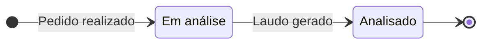

```mermaid
stateDiagram-v2
    direction LR
    [*] --> em_analise: Pedido realizado
    em_analise: Em análise
    em_analise --> Analisado: Laudo gerado
    Analisado --> [*]
```
---

[Voltar](README.md)