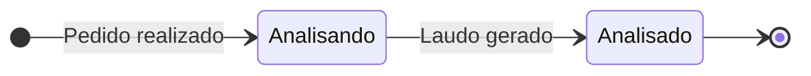

# Diagrama de Estado UC002

```mermaid
stateDiagram-v2
    direction LR
    [*] --> Analisando: Pedido realizado
    Analisando --> Analisado: Laudo gerado
    Analisado --> [*]
```
---

[Voltar](README.md)