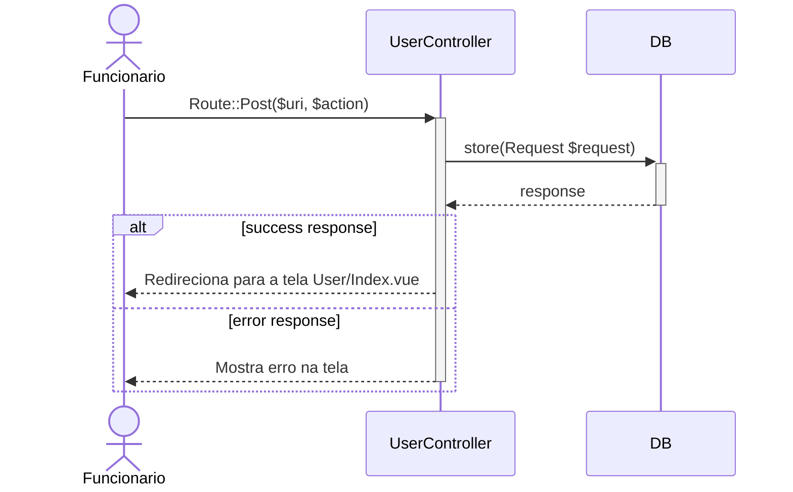
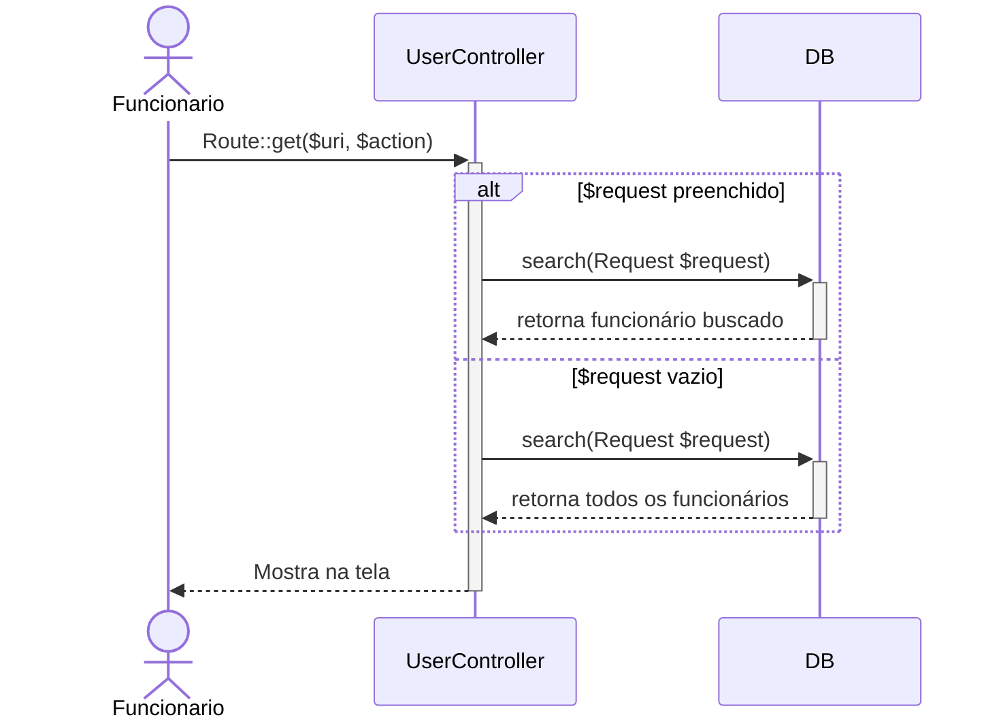
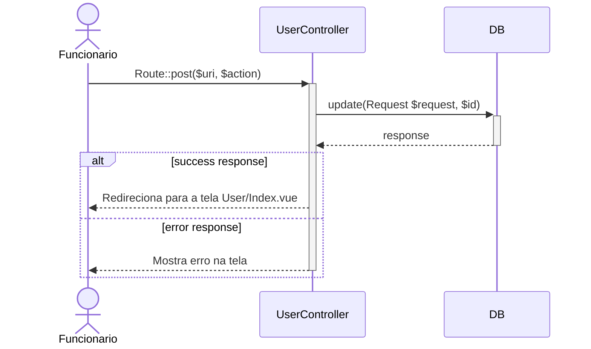

# Diagrama de Sequência

## Cadastro de Usuário

```mermaid
sequenceDiagram

actor Funcionario
Funcionario->>+UserController: Route::Post($uri, $action)

UserController->>+DB: store(Request $request)

DB-->>-UserController: response

alt success response
    UserController-->>Funcionario: Redireciona para a tela User/Index.vue
else error response
    UserController-->>-Funcionario: Mostra erro na tela
end

```

## Buscar Usuário

```mermaid
sequenceDiagram

actor Funcionario  

Funcionario->>+UserController: Route::get($uri, $action)
alt $request preenchido
UserController->>+DB: search(Request $request)
DB-->>-UserController: retorna funcionário buscado
else $request vazio
UserController->>+DB: search(Request $request)
DB-->>-UserController: retorna todos os funcionários
end
UserController-->>-Funcionario: Mostra na tela

```

## Atualizar Cadastro

```mermaid
sequenceDiagram

actor Funcionario

Funcionario->>+UserController: Route::post($uri, $action)
UserController->>+DB: update(Request $request, $id)
DB-->>-UserController: response
alt success response
    UserController-->>Funcionario: Redireciona para a tela User/Index.vue
else error response
    UserController-->>-Funcionario: Mostra erro na tela
end

```

---

[Voltar](readme.md)
