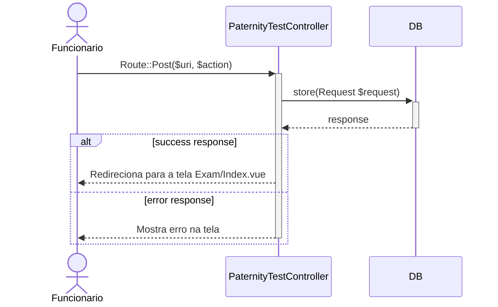
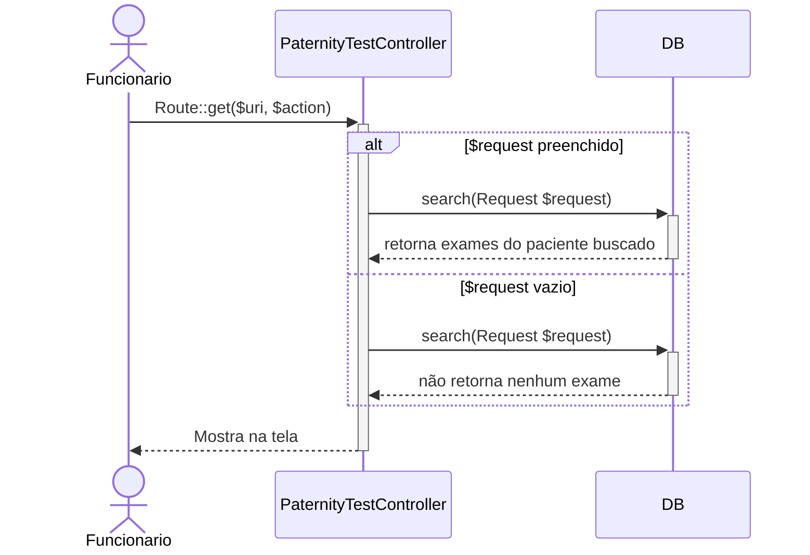
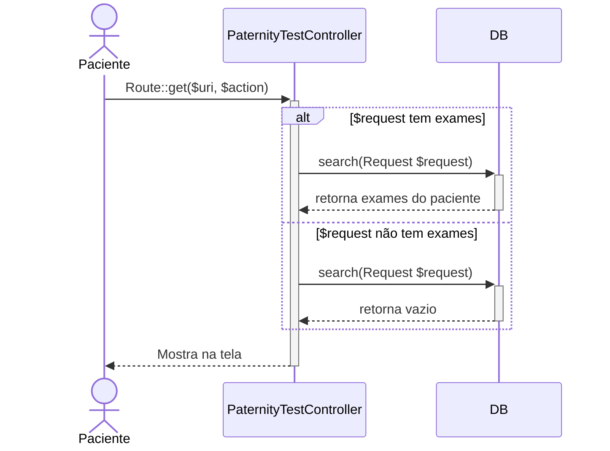
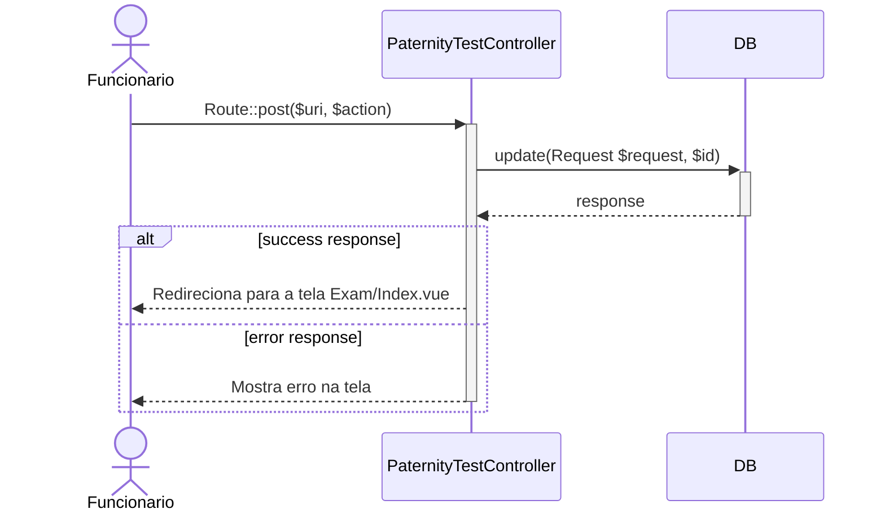

# Diagrama de Sequência

## Cadastro de Pedido

```mermaid
sequenceDiagram

actor Funcionario
Funcionario->>+PaternityTestController: Route::Post($uri, $action)

PaternityTestController->>+DB: store(Request $request)

DB-->>-PaternityTestController: response

alt success response
    PaternityTestController-->>Funcionario: Redireciona para a tela Exam/Index.vue
else error response
    PaternityTestController-->>-Funcionario: Mostra erro na tela
end

```

## Buscar Pedidos

### Caso seja um funcionário

```mermaid
sequenceDiagram

actor Funcionario  

Funcionario->>+PaternityTestController: Route::get($uri, $action)
alt $request preenchido
PaternityTestController->>+DB: search(Request $request)
DB-->>-PaternityTestController: retorna exames do paciente buscado
else $request vazio
PaternityTestController->>+DB: search(Request $request)
DB-->>-PaternityTestController: não retorna nenhum exame
end
PaternityTestController-->>-Funcionario: Mostra na tela

```

### Caso seja um paciente

```mermaid
sequenceDiagram

actor Paciente  

Paciente->>+PaternityTestController: Route::get($uri, $action)
alt $request tem exames
PaternityTestController->>+DB: search(Request $request)
DB-->>-PaternityTestController: retorna exames do paciente
else $request não tem exames
PaternityTestController->>+DB: search(Request $request)
DB-->>-PaternityTestController: retorna vazio
end
PaternityTestController-->>-Paciente: Mostra na tela

```

## Atualizar Pedido

```mermaid
sequenceDiagram

actor Funcionario

Funcionario->>+PaternityTestController: Route::post($uri, $action)
PaternityTestController->>+DB: update(Request $request, $id)
DB-->>-PaternityTestController: response
alt success response
    PaternityTestController-->>Funcionario: Redireciona para a tela Exam/Index.vue
else error response
    PaternityTestController-->>-Funcionario: Mostra erro na tela
end

```

---

[Voltar](README.md)