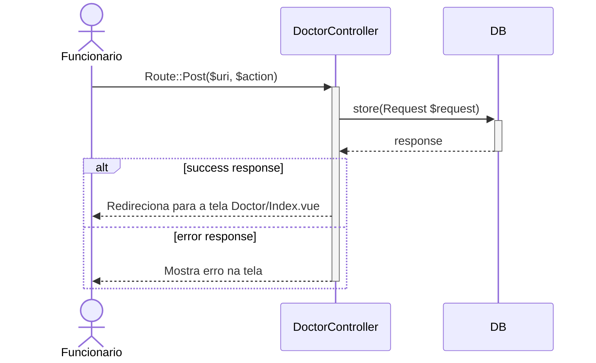
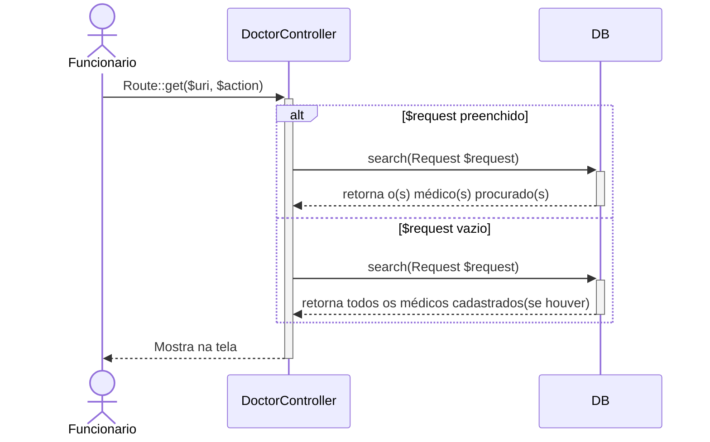
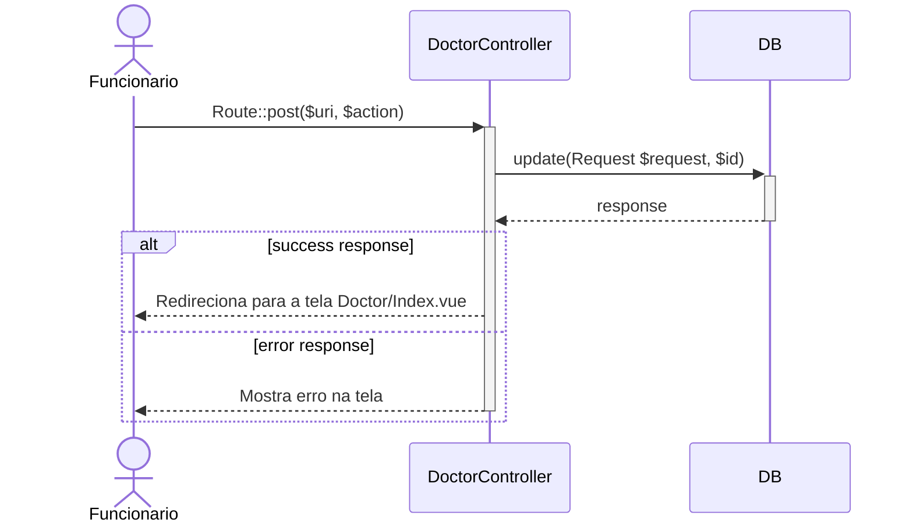

# Diagrama de Sequência

## Cadastro do médico

```mermaid
sequenceDiagram

actor Funcionario
Funcionario->>+DoctorController: Route::Post($uri, $action)

DoctorController->>+DB: store(Request $request)

DB-->>-DoctorController: response

alt success response
    DoctorController-->>Funcionario: Redireciona para a tela Doctor/Index.vue
else error response
    DoctorController-->>-Funcionario: Mostra erro na tela
end

```

## Buscar médico

```mermaid
sequenceDiagram

actor Funcionario  

Funcionario->>+DoctorController: Route::get($uri, $action)
alt $request preenchido
DoctorController->>+DB: search(Request $request)
DB-->>-DoctorController: retorna o(s) médico(s) procurado(s)
else $request vazio
DoctorController->>+DB: search(Request $request)
DB-->>-DoctorController: retorna todos os médicos cadastrados(se houver)
end
DoctorController-->>-Funcionario: Mostra na tela

```

## Atualizar informações do médico

```mermaid
sequenceDiagram

actor Funcionario

Funcionario->>+DoctorController: Route::post($uri, $action)
DoctorController->>+DB: update(Request $request, $id)
DB-->>-DoctorController: response
alt success response
    DoctorController-->>Funcionario: Redireciona para a tela Doctor/Index.vue
else error response
    DoctorController-->>-Funcionario: Mostra erro na tela
end

```

---

[Voltar](README.md)
