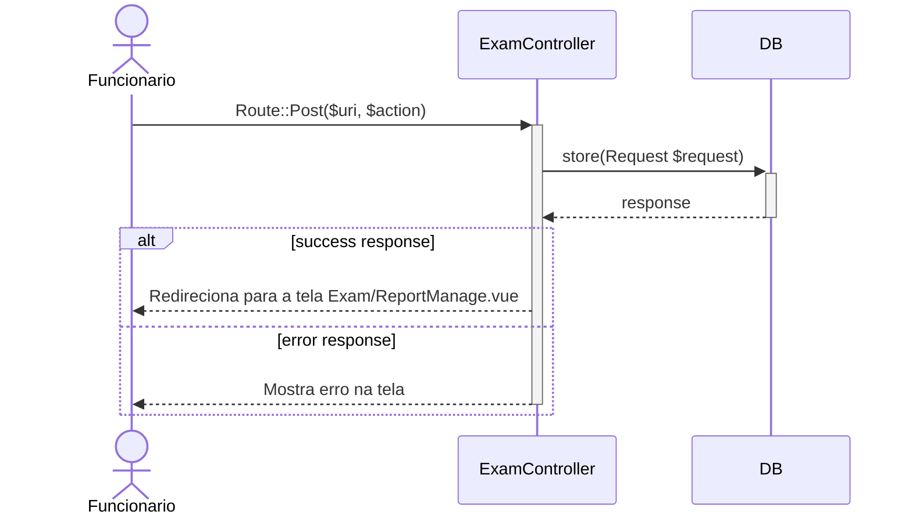
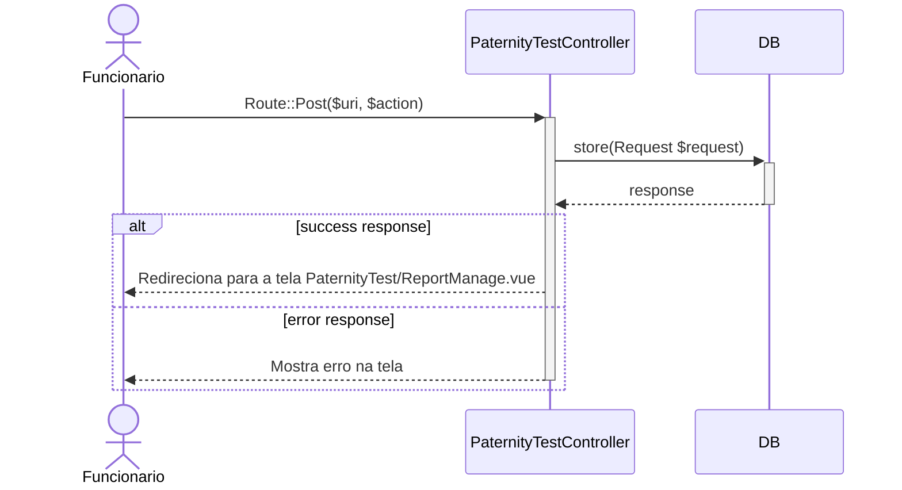
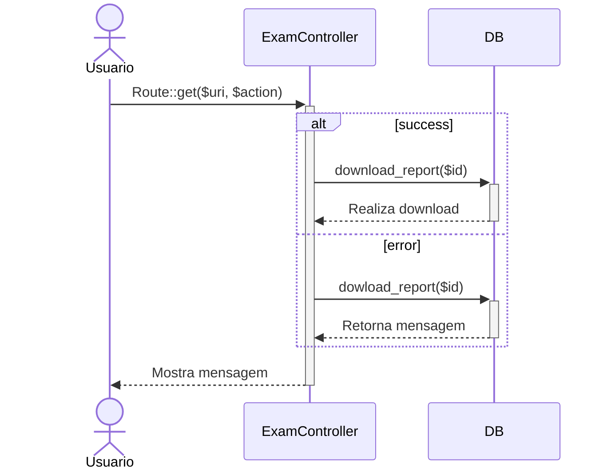
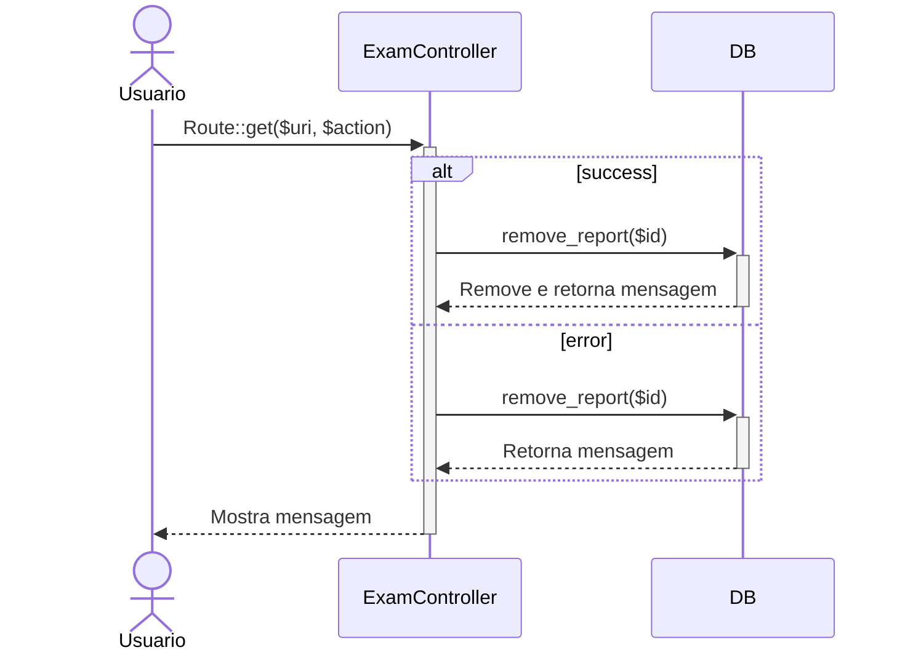

# Diagrama de Sequência

## Gerar Laudo

### Sangue

```mermaid
sequenceDiagram

actor Funcionario
Funcionario->>+ExamController: Route::Post($uri, $action)

ExamController->>+DB: store(Request $request)

DB-->>-ExamController: response

alt success response
    ExamController-->>Funcionario: Redireciona para a tela Exam/ReportManage.vue
else error response
    ExamController-->>-Funcionario: Mostra erro na tela
end

```

### Paternidade

```mermaid
sequenceDiagram

actor Funcionario
Funcionario->>+PaternityTestController: Route::Post($uri, $action)

PaternityTestController->>+DB: store(Request $request)

DB-->>-PaternityTestController: response

alt success response
    PaternityTestController-->>Funcionario: Redireciona para a tela PaternityTest/ReportManage.vue
else error response
    PaternityTestController-->>-Funcionario: Mostra erro na tela
end

```

## Download do Laudo

### Caso seja um funcionário

```mermaid
sequenceDiagram

actor Usuario 

Usuario->>+ExamController: Route::get($uri, $action)
alt success
ExamController->>+DB: download_report($id)
DB-->>-ExamController: Realiza download
else error
ExamController->>+DB: dowload_report($id)
DB-->>-ExamController: Retorna mensagem
end
ExamController-->>-Usuario: Mostra mensagem

```

## Remover Laudo

```mermaid
sequenceDiagram

actor Usuario 

Usuario->>+ExamController: Route::get($uri, $action)
alt success
ExamController->>+DB: remove_report($id)
DB-->>-ExamController: Remove e retorna mensagem
else error
ExamController->>+DB: remove_report($id)
DB-->>-ExamController: Retorna mensagem
end
ExamController-->>-Usuario: Mostra mensagem

```

---

[Voltar](README.md)
