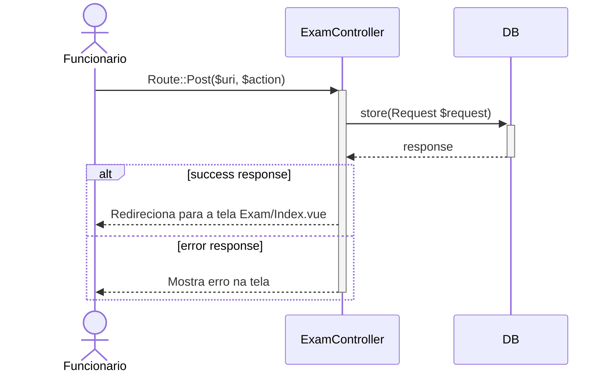
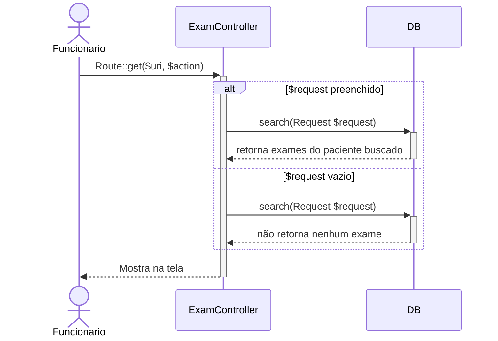
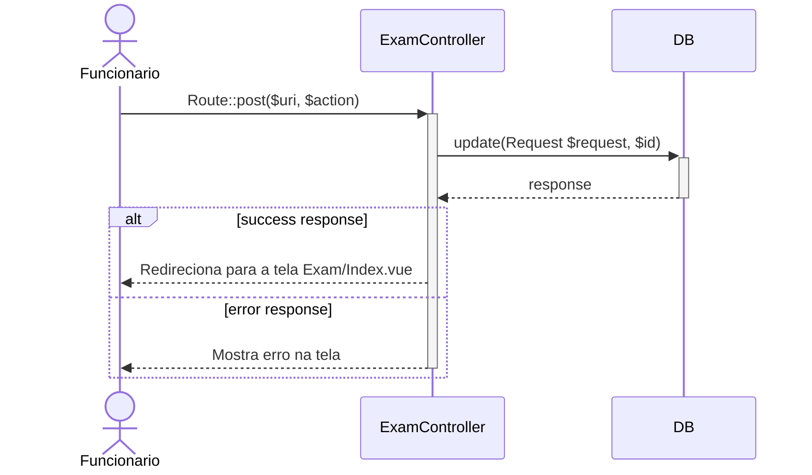

# Diagrama de Sequência

## Gerar Laudo

```mermaid
sequenceDiagram

actor Funcionario
Funcionario->>+ExamController: Route::Post($uri, $action)

ExamController->>+DB: store(Request $request)

DB-->>-ExamController: response

alt success response
    ExamController-->>Funcionario: Redireciona para a tela Exam/Index.vue
else error response
    ExamController-->>-Funcionario: Mostra erro na tela
end

```

## Download do Laudo

### Caso seja um funcionário

```mermaid
sequenceDiagram

actor Funcionario  

Funcionario->>+ExamController: Route::get($uri, $action)
alt $request preenchido
ExamController->>+DB: search(Request $request)
DB-->>-ExamController: retorna exames do paciente buscado
else $request vazio
ExamController->>+DB: search(Request $request)
DB-->>-ExamController: não retorna nenhum exame
end
ExamController-->>-Funcionario: Mostra na tela

```

## Remover Laudo

```mermaid
sequenceDiagram

actor Funcionario

Funcionario->>+ExamController: Route::post($uri, $action)
ExamController->>+DB: update(Request $request, $id)
DB-->>-ExamController: response
alt success response
    ExamController-->>Funcionario: Redireciona para a tela Exam/Index.vue
else error response
    ExamController-->>-Funcionario: Mostra erro na tela
end

```

---

[Voltar](README.md)
