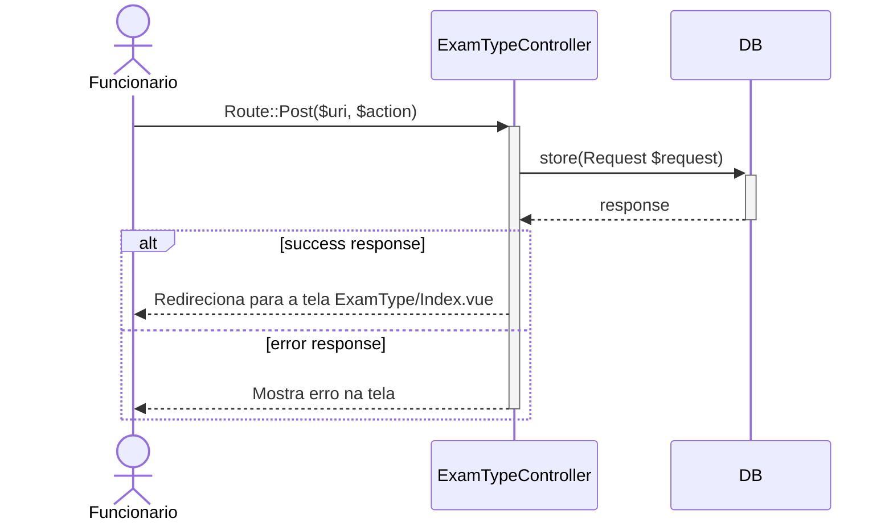
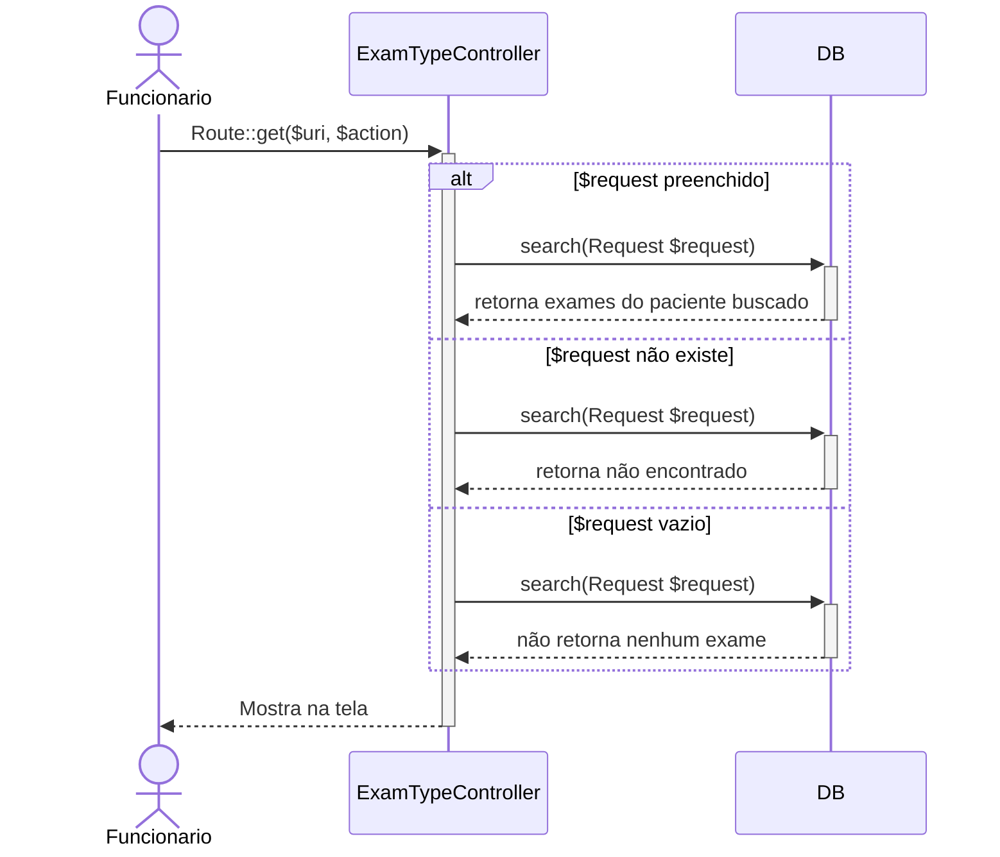
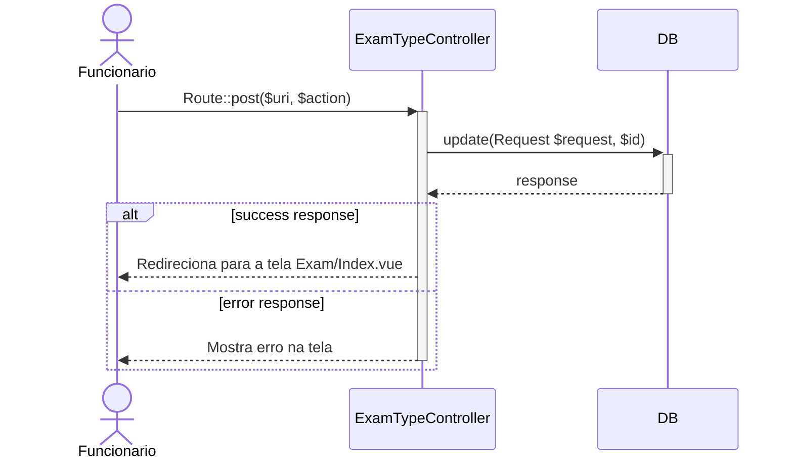

# Diagrama de Sequência

## Cadastro de Tipo de Exame

```mermaid
sequenceDiagram

actor Funcionario
Funcionario->>+ExamTypeController: Route::Post($uri, $action)

ExamTypeController->>+DB: store(Request $request)

DB-->>-ExamTypeController: response

alt success response
    ExamTypeController-->>Funcionario: Redireciona para a tela ExamType/Index.vue
else error response
    ExamTypeController-->>-Funcionario: Mostra erro na tela
end

```

## Buscar Tipo de Exame

```mermaid
sequenceDiagram

actor Funcionario  

Funcionario->>+ExamTypeController: Route::get($uri, $action)
alt $request preenchido
ExamTypeController->>+DB: search(Request $request)
DB-->>-ExamTypeController: retorna exames do paciente buscado
else $request não existe
ExamTypeController->>+DB: search(Request $request)
DB-->>-ExamTypeController: retorna não encontrado
else $request vazio
ExamTypeController->>+DB: search(Request $request)
DB-->>-ExamTypeController: não retorna nenhum exame
end
ExamTypeController-->>-Funcionario: Mostra na tela

```

## Atualizar Tipo de Exame

```mermaid
sequenceDiagram

actor Funcionario

Funcionario->>+ExamTypeController: Route::post($uri, $action)
ExamTypeController->>+DB: update(Request $request, $id)
DB-->>-ExamTypeController: response
alt success response
    ExamTypeController-->>Funcionario: Redireciona para a tela Exam/Index.vue
else error response
    ExamTypeController-->>-Funcionario: Mostra erro na tela
end

```

---

[Voltar](README.md)