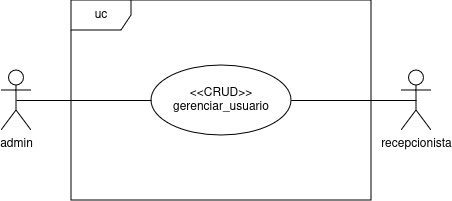

# Núcleo de Práticas em Informática - NPI   Projeto de Análises Clinicas   Especificação de Caso de Uso: UC001_gerenciar_paciente   Versão 1.1

## Histórico da Revisão

| Data | Versão | Descrição | Autor |
| ---- | ------ | --------- | ----- |
| 30/04/2024 | 1.0 | Criação do documento | Guilherme Rafael Faraco Vieira |
| 10/05/2024 | 1.1 | Documento preenchido | Guilherme Rafael Faraco Vieira |
| 27/08/2024 | 1.2 | Atualizações | Guilherme Rafael Faraco Vieira |

## Índice

1. [Breve Descrição](#breve-descrição)

2. [Fluxo Básico de Eventos](#fluxo-básico-de-eventos)

3. [Fluxos Alternativos](#fluxos-alternativos)

    1. [Cadastro de Usuário](#cadastro-de-usuário)

    2. [Busca de Usuário](#busca-de-usuário)

    3. [Atualizar Cadastro do Usuário](#atualizar-cadastro-do-usuário)

4. [Cenários Chave](#cenários-chave)

5. [Condições Prévias](#condições-prévias)

6. [Condições Posteriores](#condições-posteriores)

7. [Pontos de Extensão](#pontos-de-extensão)

8. [Requisitos Especiais](#requisitos-especiais)

    1. [Criptografia](#criptografia)

9. [Informações Adicionais](#informações-adicionais)

## Especificação de Caso de Uso: UC001 - gerenciar_usuario

Neste documento está contida as especificações dos requisitos do caso de uso estudado: UC001_gerenciar_usuario.

## Breve Descrição

O UC001_gerenciar_usuario engloba as funcionalidades *create*, *read*, *update* e *delete*. Os atores que interagem com este caso de uso são os usuários que possuem a *role admin* ou a *role receptionist*.

## Fluxo Básico de Eventos

- **Cadastrar Usuário**

1. O admin ou recepcionista clica no botão cadastrar disponível na *navbar*;

2. Será aberto uma página para inserção dos dados: nome, email, cpf, telefone, CEP, rua, número, complemento, bairro, cidade, estado, convênio e sexo biológico;

3. Após a inserção dos dados o usuário irá apertar o botão enviar;

4. Acontecerá um redirecionamento para tela inicial com uma mensagem de sucesso.

- **Buscar Usuário**

1. O admin ou recepcionista clica no botão buscar paciente disponível na *navbar*;

2. Haverá um redirecionamento para uma tela de busca onde mostrará um local para inserir o CPF do paciente;

3. Será mostrado em uma tabela os dados do paciente.

- **Atualizar Cadastro do Usuário**

1. Após fazer a busca do paciente desejado, haverá a possibilidade de alterar os dados na tabela que está mostrando o usuário;

2. Depois de feita a alteração, deve ser clicado o botão salvar.

- **Deletar Cadastro do Usuário**

1. Após fazer a busca do paciente desejado, haverá a possibilidade de alterar os dados na tabela que está mostrando o usuário;

2. Na página de edição será encontrado um botão para desativar o usuário, esse será o *delete*.

## Fluxos Alternativos

### **Cadastro de Usuário:**

- **CPF inválido:** Caso o CPF inserido não seja válido então haverá uma notificação ao clicar enviar e não será realizado nenhuma ação.
  
- **Campo necessário sem preencher:** Caso algum campo esteja em branco haverá uma notificação ao clicar enviar e não será realizado nenhuma ação.

- **Usuário já existe:** Ao enviar, caso exista um cadastro com esse CPF será enviado uma notificação e não permitirá o cadastro.

### **Busca de Usuário:**

- **Inserção de quaisquer outros dados sem ser um CPF válido:** Quando for executada a busca mostrará uma mensagem que deve ser inserido um CPF.

- **Usuário não encontrado**: Se o usuário buscado não existir, será emitido uma mensagem avisando que o paciente não foi encontrado.

### **Atualizar Cadastro do Usuário:**

- **Inserção de tipo de caracteres diferentes em campos que não esperam por esse tipo:** Se for inserido algum caractere inválido dentro de algum campo, por exemplo número no nome, será notificado ao clicar em salvar.

## Cenários Chave

- UC001_gerenciar_usuario

- UC002_gerenciar_pedido_do_exame

- UC003_gerenciar_medicos

- UC004_gerenciar_laudo

- UC005_consultar_dados_do_aparelho

- UC006_inserir_dados_teste_paternidade

## Condições Prévias

Não existe uma condição prévia desse caso de uso.

## Condições Posteriores

Esse caso de uso não exige nenhume condição posterior.

## Pontos de Extensão

Esse caso de uso não possui pontos de extensão.

## Requisitos Especiais

### Criptografia

Dentro da parte de cadastro, à principio será gerada uma senha usando os 6 primeiros digitos do CPF do paciente, essa senha deve ser criptografada dentro do banco de dados para manter a segurança da aplicação.

## Informações Adicionais

---

[Voltar](readme.md)
