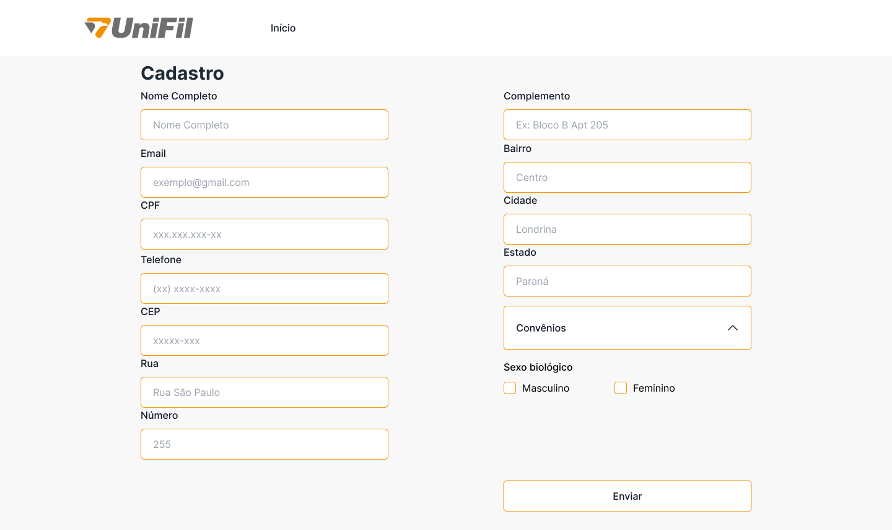
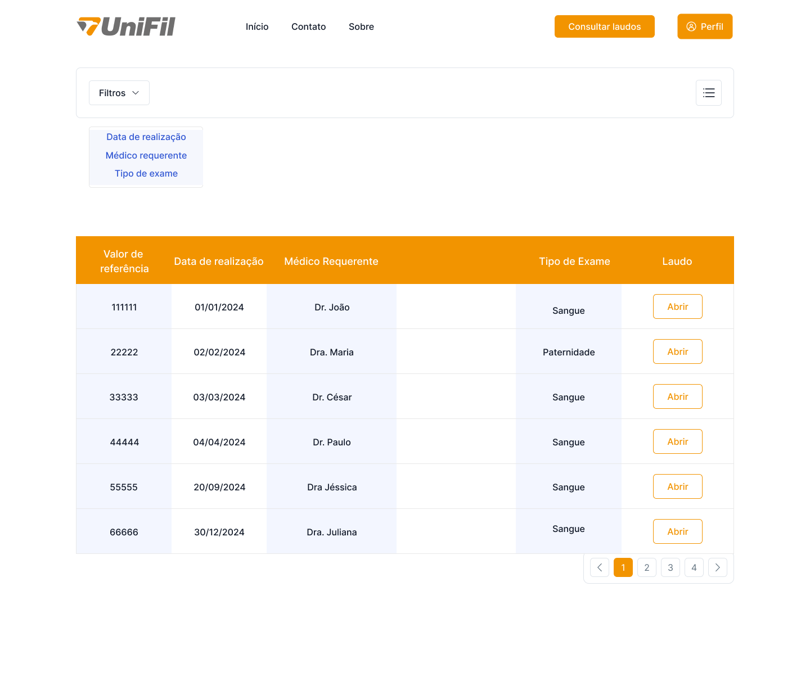

# CURSO DE BACHARELADO EM ENGENHARIA DE SOFTWARE   GUILHERME RAFAEL FARACO VIEIRA   PROJETO DE ANÁLISES CLÍNICAS   Londrina   2024

## SUMÁRIO

1. [INTRODUÇÃO](#introdução)

    1. [PROPOSTA E OBJETIVOS](#proposta-e-objetivos)

    2. [JUSTIFICATIVA](#justificativa)

2. [DIAGRAMA DE CASO DE USO](#diagrama-de-caso-de-uso)

3. [TELAS](#telas)

4. [WORKFLOW (AS IS) NA NOTAÇÃO BPMN](#workflow-as-is-na-notação-bpmn)

5. [RECURSOS E AMBIENTE DE DESENOVOLVIMENTO](#recursos-e-ambiente-de-desenovolvimento)

    1. [LINGUAGEM DE PROGRAMAÇÃO](#linguagem-de-programação)

       1. [FRONT-END](#front-end)

       2. [BACK-END](#back-end)

       3. [BANCO DE DADOS](#banco-de-dados)

    2. [DIAGRAMAÇÃO](#diagramação)

    3. [PROTOTIPAÇÃO](#prototipação)

6. [CRONOGRAMA](#cronograma)

7. [REFERÊNCIAS](#referências)

## INTRODUÇÃO

Este sistema será desenvolvido por Guilherme Rafael Faraco Vieira aluno do curso de bacharelado em Engenharia de Software e participante do Núcleo de Práticas em Informática(NPI).

O NPI é um grupo que pertence a UniFil, onde os alunos aprendem utilizando a prática, criado com o título de Empresa Júnior, com intuito de efetivar os conhecimentos do curso desenvolvendo projetos para a instituição, que contribuem imensamente com o aprendizado dos participantes. Vale ressaltar que os projetos no NPI são sem fins lucrativos, apenas para apredizado.

### PROPOSTA E OBJETIVOS

O objetivo deste projeto é prover uma aplicação *Web* que funcionará como um sistema de laboratório 24 horas por dia e todos os dias da semana com uma tela inicial explicando sobre o funcionamento da clínica e sobre os exames feitos.

- A aplicação deverá conter o gerenciamento dos usuários.

- Uma forma de colher as informações geradas pelo Analisador Hematológico que é responsável por fazer as análises do sangue.

- Um local para que o responsável pela realização do teste de paternidade possa inserir os dados gerados pela análise da amostras biológicas da mãe, filho e suposto pai.

- No exame de sangue o sistema será responsável por gerar um laudo selecionando os dados colhidos do Analisador Hematológico com base no tipo de exame pedido pelo médico do paciente. Os laudos possuirão um padrão a ser seguido.

- No teste de paternidade, será primeiramente selecionado o tipo de teste, podendo ser em trio(mãe, requerente - filho(a), suposto pai investigado), duo(requerente - filho(a), suposto pai investigado) e de reconstituição(podendo ser várias pessoas da família, ex: avós ou outra família), após a seleção do tipo de teste de paternidade, serão feito os cadastros de cada participante e então colhidos as amostras biológicas e então o responsável pelo teste de paternidade irá inserir os dados necessários para realização do teste, esse exame é realizado por meio de algumas fórmulas matemáticas que serão executadas pelo próprio sistema.

- Um local onde os usuários tenham acesso aos laudos, contendo um filtro para que fique mais simples de buscar o exame desejado e opções de *download* e compartilhamento do laudo selecionado.

### JUSTIFICATIVA

O sistema proposto ao laboratório da UniFil é uma aplicação *Web* onde conterá informações relevantes para que os pacientes entendam sobre os exames e como funciona a clínica no geral. Dentro dessa aplicação serão gerados de forma automatizada os laudos dos exames de sangue e dos testes de paternidade, também possibilitará os usuários manterem um controle dos usuários e laudos de forma fácil.

O laboratório de análises clínicas está em fase inicial, os exames ainda não estão sendo feitos em quaisquer pacientes, apenas em alguns selecionados para fim de estudos, sendo assim o laboratório necessita do Sistema de Análises Clínicas ofertado, para que não seja necessário realizar todos os processos, desde o cadastro, de forma manual.

## DIAGRAMA DE CASO DE USO

O diagrama de caso de uso tem como finalidade descrever os requisitos funcionais do sistema proposto e a relação dos usuários do sistema com relação aos requisitos colhidos.

A Figura 1 refere-se ao diagrama de caso de uso do sistema de Análises Clínicas.

Figura 1

### ATORES

#### biomedico

O biomédico é uma *role* de usuário, que está conectado aos casos de uso que um biomédico tem.

#### paciente

O paciente é uma *role* de usuário, que está conectado aos casos de uso que um paciente tem.

#### adm

O adm é uma *role* de usuário, que está conectado aos casos de uso que um adm tem.

#### recepcionista

O recepcionista é uma *role* de usuário, que está conectado aos casos de uso que um recepcionista tem.

#### sistema

O sistema é um ator que representa a interação do próprio sistema com os casos de uso.

### CASOS DE USO

#### consultar_exames

O caso de uso consultar_exames por baixo dos panos, fará a segregação entre consultar exames de sangue e de paternidade, onde apenas o adm ou o próprio paciente terão acesso aos laudos de paternidade. Importante ressaltar que os pacientes somente poderão consultar os laudos próprios.

#### \<\<CRUD\>\> gerenciar_usuario

O caso de uso gerenciar_recepcionista, permite o gerenciamento das contas do tipo recepcionista, onde apenas o adm tem acesso.

#### \<\<CRUD\>\> gerenciar_pedido_do_exame

O caso de uso gerenciar_laudos, permite o gerenciamento dos laudos, onde apenas o próprio sitema tem acesso.

#### gerar_laudo

O caso de uso alterar_dados_cadastro é conectado com o usuário, ou seja todos os tipos de usuário poderão realizar essa função, importante ressaltar que não serão todos os dados que podem ser alterados.

#### inserir_dados_teste_paternidade

O caso de uso realizar_exames, por baixo dos panos estará sendo dividido em realizar exame de sangue ou realizar teste de paternidade e depende do caso de uso capturar_dados_dos_exames ocorrer.

#### capturar_dados_do_aparelho

O caso de uso capturar_dados_do_aparelho, poderá ser a captura dos dados do exame de sangue que são colhidos do Analisador Hematológico, ou poderá ser a captura dos dados do teste de paternidade que serão inseridos pelos responsáveis por realizar esse exame.

## TELAS

A Figura 2 refere-se a tela inicial do *site* quando o usuário não está conectado a sua conta, essa tela conterá informações sobre o laboratório e os exames.

A tela inicial terá 4 variações, sendo elas:

- Sem *login*;

- Conectado como paciente ou biomédico;

- Conectado como recepcionista;

- Conectado como adm.

As diferenças entre cada uma dessas variações será no header da página, onde os botões serão alterados conforme o tipo de usuário.

O header da página sem *login* apresentará apenas o botão de *login*, se o tipo de usuário for paciente ou biomédico constará as opções de consultar exame e de perfil que abrirá o menu *dropdown* sendo possível gerenciar perfil e sair, se o tipo de usuário for recepcionista as opções disponíveis serão cadastrar usuário e a opção de perfil e se o usuário for um adm apresentará as opções de cadastrar usuário, consultar exames, realizar exame de paternidade e perfil.

Figura 2

A Figura 3 refere-se a tela de cadastro, os únicos tipos de usuário com acesso a elas são os recepcionistas e adm.

O botão de função presente na Figura 3 serve para selecionar a o tipo de usuário e somente o adm poderá cadastrar outro adm.

Figura 3

A Figura 4 refere-se a tela de *login*, onde o usuário irá entrar em sua conta.

Figura 4

A Figura 5 refere-se a tela de consultar exames, o objetivo dessa página é listar todos os exames que o paciente realizou, um meio para pesquisar para facilitar encontrar o exame desejado.

Essa tela possui algumas variações dependendo de qual o tipo de usuário que estiver acessando.

Se for um paciente, os campos que aparecerão como informações do exame serão: valor de referência, data de realização, médico requerente e o tipo de exame. O paciente poderá pesquisar filtrando por qualquer um dos campos que existem.

Se for um biomédico(a) ou um adm, os campos que aparecerão como informações do laudo serão: valor de referência, data de realização, médico requerente, nome do examinado e o tipo de exame(o biomédico não tem acesso aos exames de paternidade). O paciente poderá pesquisar filtrando por qualquer um dos campos que existem.

Figura 5

## *WORKFLOW (AS IS)* NA NOTAÇÃO BPMN

A figura 6 refere-se ao *workflow (AS-IS)* na notação BPMN e tem como objetivo definir como é solucionado atualmente o problema que o sistema tem como objetivo resolver.

Figura 6

## RECURSOS E AMBIENTE DE DESENOVOLVIMENTO

### LINGUAGEM DE PROGRAMAÇÃO

#### *FRONT-END*

No *Front-end* do sistema as tecnologias utilizadas serão:

- ***HTML5***, Linguagem de Marcação de HiperTexto, responsável por definir a estrutura do conteúdo da *Web*.

- ***CSS3***, *Cascading Style Sheets*, responsável por descrever como o conteúdo será exibido na tela.

- ***JavaScript***, conhecida como linguagem de script para páginas *Web*, é uma linguagem interpretada baseada em protótipos, multiparadigma e dinâmica.

- ***[Vue.js](https://vuejs.org/)*** v3, um framework de criação de interfaces de usuário na Web.

- ***[Node.js](https://nodejs.org/en)*** v20.12.0,

- ***[npm](https://www.npmjs.com/)*** v10.5.0,

- ***[Tailwind CSS](https://tailwindcss.com/)*** v3.4.3,

- ***[DaisyUI](https://daisyui.com/)*** v4.10.1, uma biblioteca de componentes para *Tailwind CSS*.

#### *BACK-END*

No *Back-end* do sistema as técnologias utilizadas serão:

- ***[Laravel 11](https://laravel.com/)***, um *framework* para construir aplicações *Web*.

- ***[InertiaJS](https://inertiajs.com/)***, permite o usuário criar inteiramente um *single-page app* cliente-servidor renderizado sem precisar de uma API.

#### BANCO DE DADOS

Será utilizado o sistema de gerenciamento de banco de dados ***[PostgreSQL](https://www.postgresql.org/)*** v16.

### DIAGRAMAÇÃO

Para realizar os diagramas foi utilizado as seguintes ferramentas:

- ***[draw.io](https://www.drawio.com/)***

- ***[HEFLO](https://www.heflo.com/pt-br/)***

- ***[Mermaid](https://mermaid.js.org/)***

### PROTOTIPAÇÃO

Para a prototipação do projeto foi utilizado uma ferramenta *Web* chamada ***[Figma](https://www.figma.com)***.

## CRONOGRAMA

A Figura 7 refere-se ao cronograma do projeto, que é uma ferramenta para organização, onde é colocado prazo para realizar cada tarefa do projeto.

Figura 7

## REFERÊNCIAS

RIBEIRO, L. Diagramas de Caso de Uso: O que é UML ? Disponível em: <https://www.devmedia.com.br/o-que-e-uml-e-diagramas-de-caso-de-uso-introducao-pratica-a-uml/23408>. Acesso em: 3 abr. 2024.

JavaScript. Disponível em: <https://developer.mozilla.org/pt-BR/docs/Web/JavaScript>. Acesso em: 6 abr. 2024.

---

[Voltar](readme.md)
