CURSO DE BACHARELADO EM ENGENHARIA DE SOFTWARE\
Guilherme Rafael Faraco Vieira\
Mário Henrique Akihiko da Costa Adaniya\
PROJETO DE ANÁLISES CLÍNICAS\
Londrina\
2024
===

## SUMÁRIO

1. [AGRADECIMENTOS](#agradecimentos)
   
2. [INTRODUÇÃO](#introdução)
   
3. [DESCRIÇÃO DO SISTEMA](#descrição-do-sistema)
   
4. [MODELAGEM DO SISTEMA](#modelagem-do-sistema)
   
  1. [DIAGRAMA DE CASO DE USO](#diagrama-de-caso-de-uso)
   
  2. [DIAGRAMA DE CLASSE](#diagrama-de-classe)
   
  3. [DIAGRAMA DE ENTIDADE E RELACIONAMENTO](#diagrama-de-entidade-e-relacionamento)
  
  4. [CASOS DE USO](#casos-de-uso)
     
     1. [UC001_GERENCIAR_USUARIO](#uc001_gerenciar_usuario)
     
     2. [UC002_gerenciar_pedido_do_exame_de_sangue](#UC002_gerenciar_pedido_do_exame_de_sangue)
     
     3. [UC003_gerenciar_pedido_do_exame_de_paternidade](#uc003_gerenciar_pedido_do_exame_de_paternidade)

     4. [UC004_GERENCIAR_MEDICO](#UC004_gerenciar_medico)

     5. [UC005_GERENCIAR_TIPO_DE_EXAME](#UC005_gerenciar_tipo_de_exame)

     6. [UC006_GERENCIAR_LAUDO](#UC006_gerenciar_laudo)

5. [CONCLUSÕES E TRABALHOS FUTUROS](#conclusões-e-trabalhos-futuros)

6. [REFERÊNCIAS](#referências)
   
7. [APÊNDICE](#apêncice)
   
   1. [ARTEFATOS DE REQUISITOS](#artefatos-de-requisitos)
   
   2. [DIAGRAMAS](#diagramas)

## AGRADECIMENTOS

Neste momento de conclusão do meu estágio, sinto-me profundamente grato por todo o apoio e orientação que recebi ao longo dessa jornada.

Primeiramente, gostaria de expressar meu sincero agradecimento ao meu professor orientador, Mário Henrique Akihiko da Costa Adaniya. Sua orientação, paciência e conselhos valiosos foram fundamentais para o desenvolvimento deste trabalho e para meu crescimento pessoal e profissional. Agradeço pelo tempo dedicado e por todo o apoio durante esse ano. 

Aos meus colegas da área, meu mais sincero obrigado. Que durante os tempos difíceis estivemos em contato ajudando uns aos outros.

Por fim, agradeço a Deus por me guiar e iluminar em todos os momentos desta jornada.

## INTRODUÇÃO

Este sistema foi desenvolvido por Guilherme Rafael Faraco Vieira aluno do curso de bacharelado em Engenharia de Software e participante do Núcleo de Práticas em Informática(NPI).

O NPI é um grupo que pertence a UniFil, onde os alunos aprendem utilizando a prática, criado com o título de Empresa Júnior, com intuito de efetivar os conhecimentos do curso desenvolvendo projetos para a instituição, que contribuem imensamente com o aprendizado dos participantes. Vale ressaltar que os projetos no NPI são sem fins lucrativos, apenas para apredizado.

O sistema proposto ao laboratório da UniFil é uma aplicação *Web* onde conterá informações relevantes para que os pacientes entendam sobre os exames e como funciona a clínica no geral. Dentro dessa aplicação serão gerados de forma automatizada os laudos dos exames de sangue e dos testes de paternidade, também possibilitará os usuários manterem um controle dos usuários e laudos de forma fácil.

O laboratório de análises clínicas está em fase inicial, os exames ainda não estão sendo feitos em quaisquer pacientes, apenas em alguns selecionados para fim de estudos, sendo assim o laboratório necessita do Sistema de Análises Clínicas ofertado, para que não seja necessário realizar todos os processos, desde o cadastro, de forma manual.

## DESCRIÇÃO DO SISTEMA

O objetivo deste projeto é prover uma aplicação *Web* que funcionará como um sistema de laboratório 24 horas por dia e todos os dias da semana com uma tela inicial explicando sobre o funcionamento da clínica e sobre os exames feitos.

- A aplicação deverá conter o gerenciamento dos usuários.

- Uma forma de colher as informações geradas pelo Analisador Hematológico que é responsável por fazer as análises do sangue.

- Um local para que o responsável pela realização do teste de paternidade possa inserir os dados gerados pela análise da amostras biológicas da mãe, filho e suposto pai.

- No exame de sangue o sistema será responsável por gerar um laudo selecionando os dados colhidos do Analisador Hematológico com base no tipo de exame pedido pelo médico do paciente. Os laudos possuirão um padrão a ser seguido.

- No teste de paternidade, será primeiramente selecionado o tipo de teste, podendo ser em trio(mãe, requerente - filho(a), suposto pai investigado), duo(requerente - filho(a), suposto pai investigado) e de reconstituição(podendo ser várias pessoas da família, ex: avós ou outra família), após a seleção do tipo de teste de paternidade, serão feito os cadastros de cada participante e então colhidos as amostras biológicas e então o responsável pelo teste de paternidade irá inserir os dados necessários para realização do teste, esse exame é realizado por meio de algumas fórmulas matemáticas que serão executadas pelo próprio sistema.

- Um local onde os usuários tenham acesso aos laudos, contendo um filtro para que fique mais simples de buscar o exame desejado e opções de *download* e compartilhamento do laudo selecionado.

### *FRONT-END*

No *Front-end* do sistema as tecnologias utilizadas serão:

- ***HTML5***, Linguagem de Marcação de HiperTexto, responsável por definir a estrutura do conteúdo da *Web*;

- ***CSS3***, *Cascading Style Sheets*, responsável por descrever como o conteúdo será exibido na tela;

- ***JavaScript***, conhecida como linguagem de script para páginas *Web*, é uma linguagem interpretada baseada em protótipos, multiparadigma e dinâmica;

- ***[Vue.js](https://vuejs.org/)*** v3, um framework de criação de interfaces de usuário na Web;

- ***[Node.js](https://nodejs.org/en)*** v20.12.0, ambiente de código em tempo de execução do JavaScript, permite a criação de servers, web apps, ferramentas de linha de comando e scripts;

- ***[npm](https://www.npmjs.com/)*** v10.5.0, node package manager, permite gerenciar os pacotes JavaScript;

- ***[Tailwind CSS](https://tailwindcss.com/)*** v3.4.3, disponibiliza várias classes CSS para serem usadas;

- ***[PrimeVue](https://primevue.org/)*** v4.0.4, UI components para Vue.js.

### *BACK-END*

No *Back-end* do sistema as técnologias utilizadas serão:

- ***[Laravel 11](https://laravel.com/)***, um *framework* para construir aplicações *Web*.

- ***[InertiaJS](https://inertiajs.com/)***, permite o usuário criar inteiramente um *single-page app* cliente-servidor renderizado sem precisar de uma API.

### BANCO DE DADOS

Será utilizado o sistema de gerenciamento de banco de dados ***[PostgreSQL](https://www.postgresql.org/)*** v16.

### DIAGRAMAÇÃO

Para realizar os diagramas foi utilizado as seguintes ferramentas:

- ***[draw.io](https://www.drawio.com/)***

- ***[HEFLO](https://www.heflo.com/pt-br/)***

- ***[Mermaid](https://mermaid.js.org/)***

### PROTOTIPAÇÃO

Para a prototipação do projeto foi utilizado uma ferramenta *Web* chamada ***[Figma](https://www.figma.com)***.

## MODELAGEM DO SISTEMA

### DIAGRAMA DE CASO DE USO

O diagrama de caso de uso tem como finalidade descrever os requisitos funcionais do sistema proposto e a relação dos usuários do sistema com relação aos requisitos colhidos.

A Figura 1 refere-se ao diagrama de caso de uso do sistema de Análises Clínicas.

Figura 1

### DIAGRAMA DE CLASSE

O diagrama de classes é uma ferramenta essencial na modelagem orientada a objetos, proporcionando uma visão detalhada e estruturada do sistema que é crucial para o desenvolvimento de software eficiente e bem-organizado.

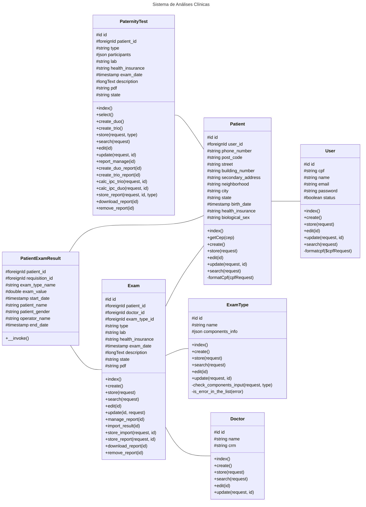
```mermaid
---
title: Sistema de Análises Clínicas
---
classDiagram

direction RL


User --  Patient

Patient -- PaternityTest

Patient -- PatientExamResult

Patient -- Exam

ExamType -- Exam

Doctor -- Exam

Exam -- PatientExamResult

class User {
    #id id
    #string cpf 
    #string name
    #string email
    #string password
    #boolean status
    +index()
    +create()
    +store(request)
    +edit(id)
    +update(request, id)
    +search(request)
    -formatcpf($cpfRequest)
}

class Patient{
    #id id
    #foreignId user_id
    #string phone_number
    #string post_code
    #string street
    #string building_number
    #string secondary_address
    #string neighborhood
    #string city
    #string state
    #timestamp birth_date
    #string health_insurance
    #string biological_sex
    +index()
    +getCep(cep)
    +create()
    +store(request)
    +edit(id)
    +update(request, id)
    +search(request)
    -formatCpf(cpfRequest)
}

class Exam {
    #id id
    #foreignId patient_id
    #foreignId doctor_id
    #foreignId exam_type_id
    #string type
    #string lab
    #string health_insurance
    #timestamp exam_date
    #longText description
    #string state
    #string pdf
    +index()
    +create()
    +store(request)
    +search(request)
    +edit(id)
    +update(id, request)
    +manage_report(id)
    +import_result(id)
    +store_import(request, id)
    +store_report(request, id)
    +download_report(id)
    +remove_report(id)

}

class Doctor {
    #id id
    #string name
    #string crm
    +index()
    +create()
    +store(request)
    +search(request)
    +edit(id)
    +update(request, id)
}

class ExamType {
    #id id
    #string name
    #json components_info
    +index()
    +create()
    +store(request)
    +search(request)
    +edit(id)
    +update(request, id)
    -check_components_input(request, type)
    -is_error_in_the_list(error)
}

class PaternityTest {
    #id id
    #foreignId patient_id
    #string type
    #json participants
    #string lab
    #string health_insurance
    #timestamp exam_date
    #longText description
    #string pdf
    #string state
    +index()
    +select()
    +create_duo()
    +create_trio()
    +store(request, type)
    +search(request)
    +edit(id)
    +update(request, id)
    +report_manage(id)
    +create_duo_report(id)
    +create_trio_report(id)
    +calc_ipc_trio(request, id)
    +calc_ipc_duo(request, id)
    +store_report(request, id, type)
    +download_report(id)
    +remove_report(id)
}

class PatientExamResult {
    #foreignId patient_id
    #foreignId requisition_id
    #string exam_type_name
    #double exam_value
    #timestamp start_date
    #string patient_name
    #string patient_gender
    #string operator_name
    #timestamp end_date
    +__invoke()
}


```

### DIAGRAMA DE ENTIDADE E RELACIONAMENTO

O diagrama ER é uma ferramenta crucial na modelagem de dados, permitindo que você visualize e organize as informações de forma estruturada e lógica, o que é essencial para o design e implementação eficaz de sistemas de banco de dados.

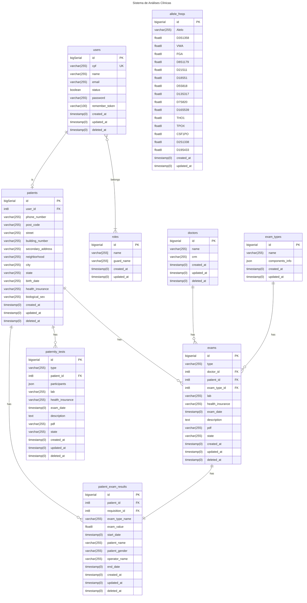
```mermaid
---
title: Sistema de Análises Clínicas
---
erDiagram

users only one -- zero or one patients : is
users zero or many -- one or many roles : belongs
patients only one -- zero or many exams : has
patients only one -- zero or many paternity_tests : has
patients only one -- zero or many patient_exam_results: has
doctors only one -- zero or many exams : has
exam_types only one -- zero or many exams: has
exams only one -- only one patient_exam_results: has


users {
    bigSerial id PK
    varchar(255) cpf UK
    varchar(255) name
    varchar(255) email
    boolean status
    varchar(255) password
    varchar(100) remember_token
    timestamp(0) created_at
    timestamp(0) updated_at
    timestamp(0) deleted_at
}

patients {
    bigSerial id PK
    int8 user_id FK
    varchar(255) phone_number
    varchar(255) post_code
    varchar(255) street
    varchar(255) building_number
    varchar(255) secondary_address
    varchar(255) neighborhood
    varchar(255) city
    varchar(255) state
    varchar(255) birth_date
    varchar(255) health_insurance
    varchar(255) biological_sex
    timestamp(0) created_at
    timestamp(0) updated_at
    timestamp(0) deleted_at

}

doctors {
    bigserial id PK
    varchar(255) name
    varchar(255) crm
    timestamp(0) created_at
    timestamp(0) updated_at
    timestamp(0) deleted_at
}

roles {
    bigserial id PK
    varchar[255] name
    varchar[255] guard_name
    timestamp(0) created_at
    timestamp(0) updated_at

}

exams {
    bigserial id PK
    varchar(255) type
    int8 doctor_id FK
    int8 patient_id FK
    int8 exam_type_id FK
    varchar(255) lab
    varchar(255) health_insurance
    timestamp(0) exam_date
    text description
    varchar(255) pdf
    varchar(255) state
    timestamp(0) created_at
    timestamp(0) updated_at
    timestamp(0) deleted_at
}

exam_types {
    bigserial id PK
    varchar(255) name
    json components_info
    timestamp(0) created_at
    timestamp(0) updated_at
}

paternity_tests {
    bigserial id PK
    varchar(255) type
    int8 patient_id FK
    json participants
    varchar(255) lab
    varchar(255) health_insurance
    timestamp(0) exam_date
    text description
    varchar(255) pdf
    varchar(255) state
    timestamp(0) created_at
    timestamp(0) updated_at
    timestamp(0) deleted_at
}

patient_exam_results {
    bigserial id PK
    int8 patient_id FK
    int8 requisition_id FK
    varchar(255) exam_type_name
    float8 exam_value
    timestamp(0) start_date
    varchar(255) patient_name
    varchar(255) patient_gender
    varchar(255) operator_name
    timestamp(0) end_date
    timestamp(0) created_at
    timestamp(0) updated_at
    timestamp(0) deleted_at
}

allele_freqs {
    bigserial id PK
    varchar(255) Alelo
    float8 D3S1358
    float8 VWA
    float8 FGA
    float8 D8S1179
    float8 D21S11
    float8 D18S51
    float8 D5S818
    float8 D13S317
    float8 D7S820
    float8 D16S539
    float8 THO1
    float8 TPOX
    float8 CSF1PO
    float8 D2S1338
    float8 D19S433
    timestamp(0) created_at
    timestamp(0) updated_at
}

```

### CASOS DE USO

#### UC001_GERENCIAR_USUARIO

O caso de uso UC001_gerenciar_usuario, permite o gerenciamento de todos as roles de usuário, onde apenas o admin tem acesso, A única excessão é a *role* paciente, que poderá ser editada pela recepcionista.

##### Telas

###### Funcionários

**Index**

A Figura 2 é responsável por exibir os funcionários cadastrados.

Figura 2

**Edit**

A Figura 3 é responsável por editar os dados dos funcionários cadastrados.

Figura 3

**Create**

A Figura 4 é responsável por criar novos cadastros de funcionário.

Figura 4

###### Pacientes

**Index**

A Figura 5 é responsável por exibir os pacientes cadastrados.

Figura 5

**Edit**

A Figura 6 é responsável por editar os dados dos pacientes cadastrados.

Figura 6

**Create**

A Figura 7 é responsável por criar novos cadastros de paciente.

Figura 7

##### Diagrama de sequência

**Cadastro de Usuário**

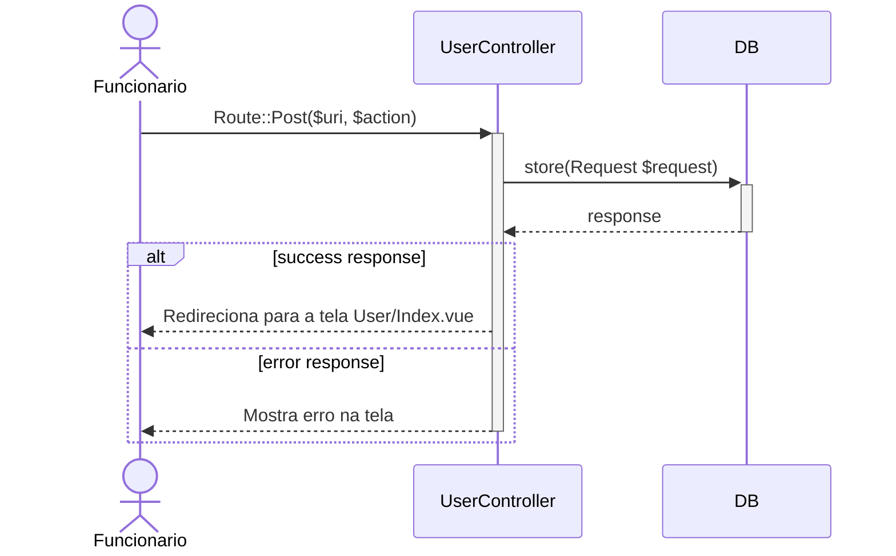
```mermaid
sequenceDiagram

actor Funcionario
Funcionario->>+UserController: Route::Post($uri, $action)

UserController->>+DB: store(Request $request)

DB-->>-UserController: response

alt success response
    UserController-->>Funcionario: Redireciona para a tela User/Index.vue
else error response
    UserController-->>-Funcionario: Mostra erro na tela
end

```

**Buscar Usuário**

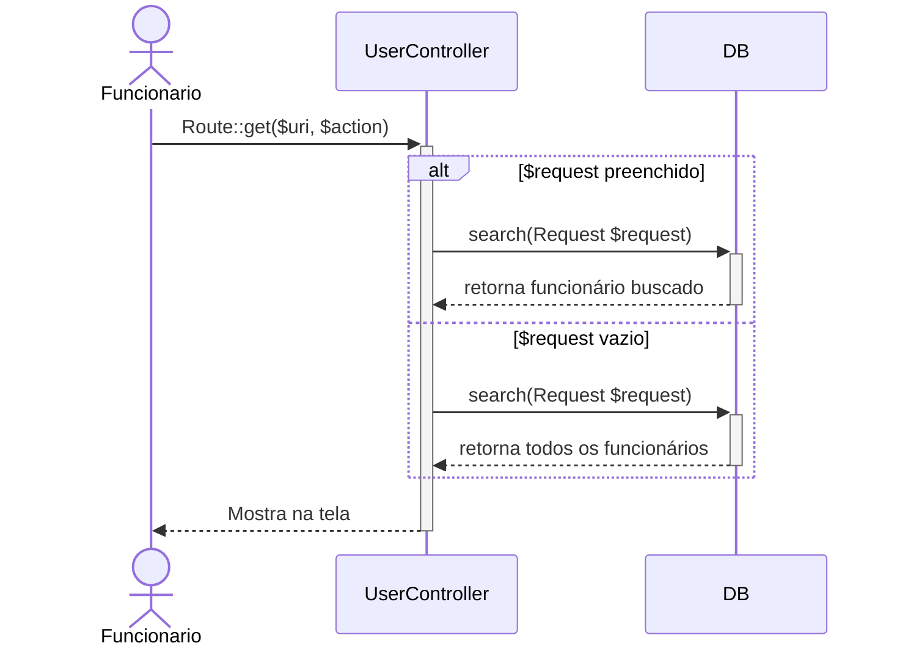
```mermaid
sequenceDiagram

actor Funcionario  

Funcionario->>+UserController: Route::get($uri, $action)
alt $request preenchido
UserController->>+DB: search(Request $request)
DB-->>-UserController: retorna funcionário buscado
else $request vazio
UserController->>+DB: search(Request $request)
DB-->>-UserController: retorna todos os funcionários
end
UserController-->>-Funcionario: Mostra na tela

```

**Atualizar Cadastro**

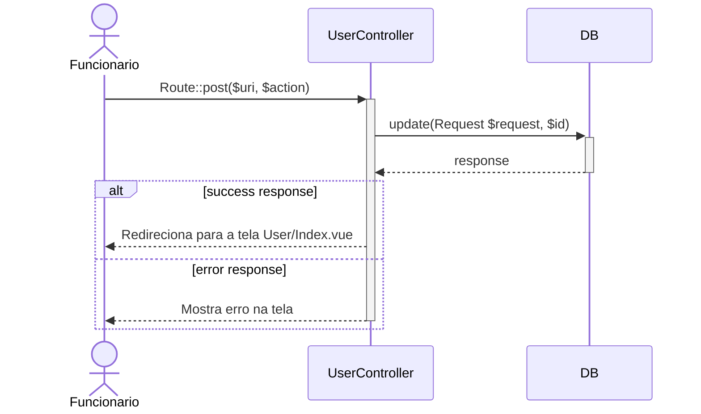
```mermaid
sequenceDiagram

actor Funcionario

Funcionario->>+UserController: Route::post($uri, $action)
UserController->>+DB: update(Request $request, $id)
DB-->>-UserController: response
alt success response
    UserController-->>Funcionario: Redireciona para a tela User/Index.vue
else error response
    UserController-->>-Funcionario: Mostra erro na tela
end

```

#### UC002_gerenciar_pedido_do_exame_de_sangue

O caso de uso UC002_gerenciar_pedido_do_exame_de_sangue permite o gerenciamento dos pedidos de exames de sangue.

Apenas o admin, biomédico e recepcionista tem acesso completo aos pedidos de exames de sangue.

No caso dos pacientes, eles podem apenas visualizar os pedidos de exame que estão ligados à eles.

##### Telas

**Index**

A Figura 8 é onde é exibido os pedidos dos exames de sangue.

Figura 8

**Edit**

A Figura 9 é responsável pela edição do pedido.

Figura 9

**Create**

A Figura 10 é responsável pela criação do pedido.

Figura 10

##### Diagrama de sequência

**Cadastro de Pedido**

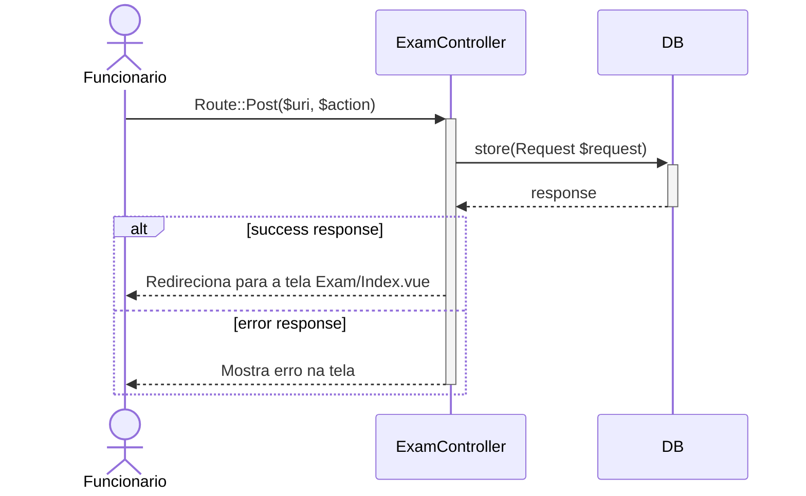
```mermaid
sequenceDiagram

actor Funcionario
Funcionario->>+ExamController: Route::Post($uri, $action)

ExamController->>+DB: store(Request $request)

DB-->>-ExamController: response

alt success response
    ExamController-->>Funcionario: Redireciona para a tela Exam/Index.vue
else error response
    ExamController-->>-Funcionario: Mostra erro na tela
end

```

**Buscar Pedidos**

**Caso seja um funcionário**

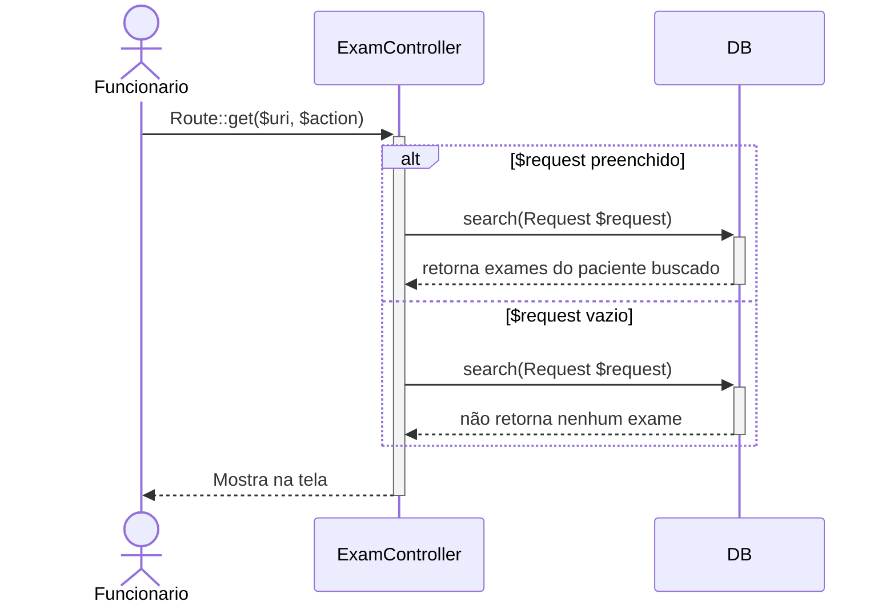
```mermaid
sequenceDiagram

actor Funcionario  

Funcionario->>+ExamController: Route::get($uri, $action)
alt $request preenchido
ExamController->>+DB: search(Request $request)
DB-->>-ExamController: retorna exames do paciente buscado
else $request vazio
ExamController->>+DB: search(Request $request)
DB-->>-ExamController: não retorna nenhum exame
end
ExamController-->>-Funcionario: Mostra na tela

```

**Caso seja um paciente**

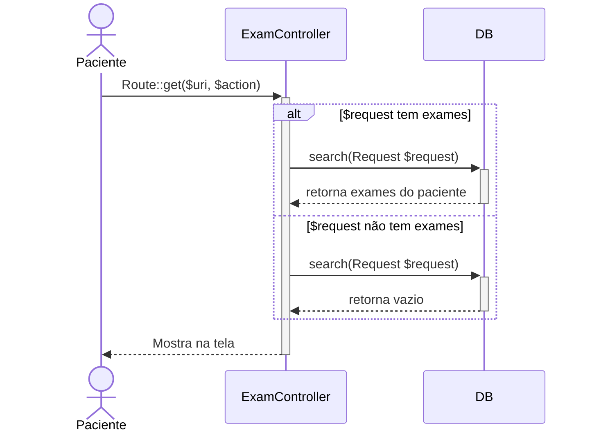
```mermaid
sequenceDiagram

actor Paciente  

Paciente->>+ExamController: Route::get($uri, $action)
alt $request tem exames
ExamController->>+DB: search(Request $request)
DB-->>-ExamController: retorna exames do paciente
else $request não tem exames
ExamController->>+DB: search(Request $request)
DB-->>-ExamController: retorna vazio
end
ExamController-->>-Paciente: Mostra na tela

```

**Atualizar Pedido**

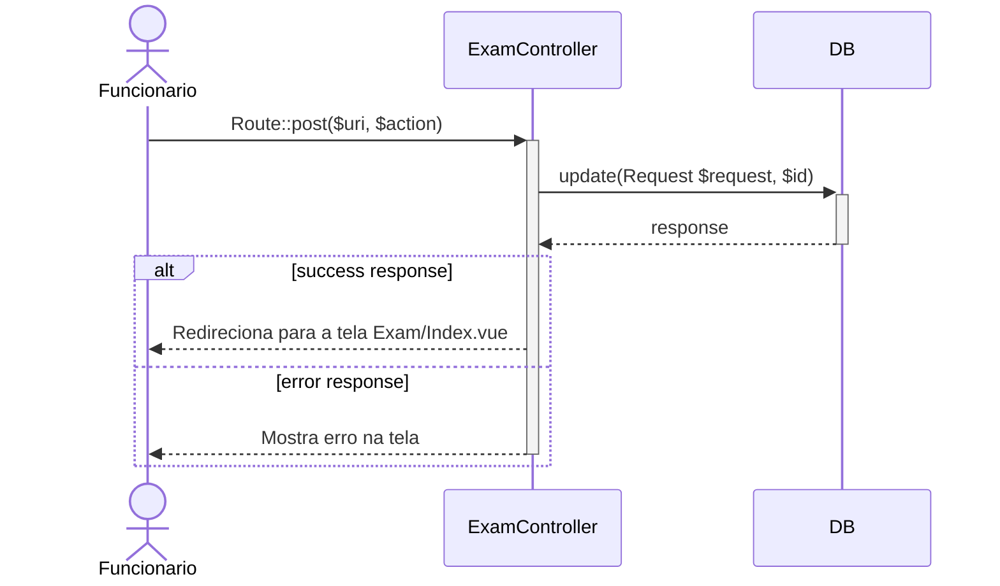
```mermaid
sequenceDiagram

actor Funcionario

Funcionario->>+ExamController: Route::post($uri, $action)
ExamController->>+DB: update(Request $request, $id)
DB-->>-ExamController: response
alt success response
    ExamController-->>Funcionario: Redireciona para a tela Exam/Index.vue
else error response
    ExamController-->>-Funcionario: Mostra erro na tela
end

```

#### UC003_gerenciar_pedido_do_exame_de_paternidade

O caso de uso UC003_gerenciar_pedido_do_exame_de_paternidade permite o gerenciamento dos pedidos de exame de paternidade.

Apenas o admin, biomédico e recepcionista tem acesso completo aos pedidos de exame de paternidade.

No caso dos pacientes, eles podem apenas visualizar os pedidos de exame que estão ligados à eles.

##### Telas

###### Index

A Figura 11 é responsável por exibir os pedidos dos exames de paternidade.

Figura 11

###### Edit

A Figura 12 é responsável por editar os pedidos.

Figura 13

###### Select

A Figura 14 é responsável por selecionar o tipo de teste de paternidade que deseja criar o pedido.

Figura 14

###### Create

As Figuras 15 e 16 são responsáveis por criar os exames de duo e trio.

Figura 15

Figura 16

##### Diagrama de sequência

**Cadastro de Pedido**

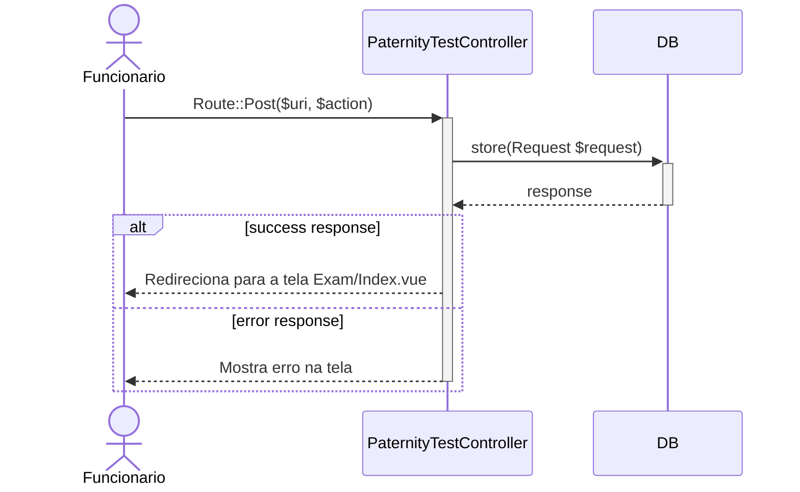
```mermaid
sequenceDiagram

actor Funcionario
Funcionario->>+PaternityTestController: Route::Post($uri, $action)

PaternityTestController->>+DB: store(Request $request)

DB-->>-PaternityTestController: response

alt success response
    PaternityTestController-->>Funcionario: Redireciona para a tela Exam/Index.vue
else error response
    PaternityTestController-->>-Funcionario: Mostra erro na tela
end

```

**Buscar Pedidos**

**Caso seja um funcionário**

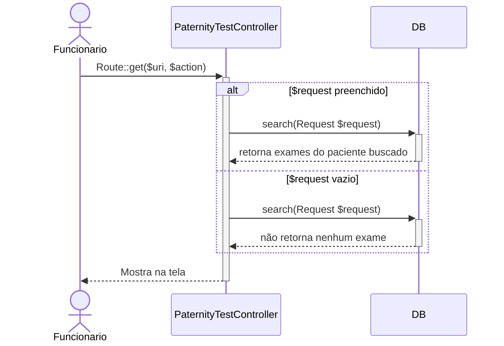
```mermaid
sequenceDiagram

actor Funcionario  

Funcionario->>+PaternityTestController: Route::get($uri, $action)
alt $request preenchido
PaternityTestController->>+DB: search(Request $request)
DB-->>-PaternityTestController: retorna exames do paciente buscado
else $request vazio
PaternityTestController->>+DB: search(Request $request)
DB-->>-PaternityTestController: não retorna nenhum exame
end
PaternityTestController-->>-Funcionario: Mostra na tela

```

**Caso seja um paciente**

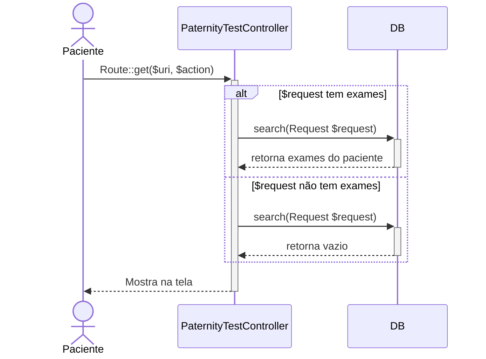
```mermaid
sequenceDiagram

actor Paciente  

Paciente->>+PaternityTestController: Route::get($uri, $action)
alt $request tem exames
PaternityTestController->>+DB: search(Request $request)
DB-->>-PaternityTestController: retorna exames do paciente
else $request não tem exames
PaternityTestController->>+DB: search(Request $request)
DB-->>-PaternityTestController: retorna vazio
end
PaternityTestController-->>-Paciente: Mostra na tela

```

**Atualizar Pedido**

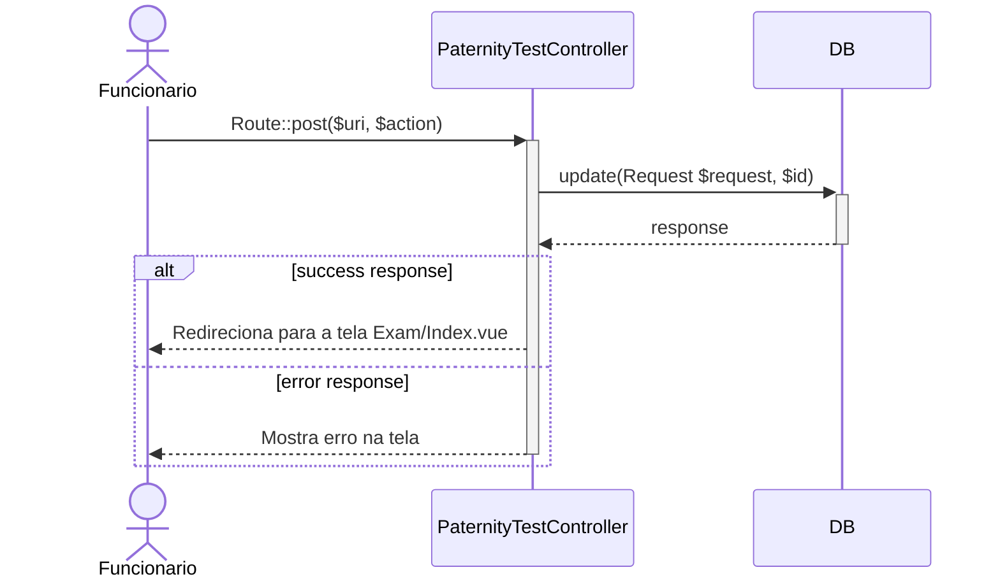
```mermaid
sequenceDiagram

actor Funcionario

Funcionario->>+PaternityTestController: Route::post($uri, $action)
PaternityTestController->>+DB: update(Request $request, $id)
DB-->>-PaternityTestController: response
alt success response
    PaternityTestController-->>Funcionario: Redireciona para a tela Exam/Index.vue
else error response
    PaternityTestController-->>-Funcionario: Mostra erro na tela
end

```

#### UC004_GERENCIAR_MEDICO

O caso de uso UC004_gerenciar_medico permite o gerenciamento dos médicos no sistema, apenas o admin e o recepcionista tem acesso ao caso de uso.

##### Telas

###### Médicos

**Index**

A Figura 17 é responsável por exibir os médicos cadastrados.

Figura 17

**Edit**

A Figura 18 é responsável por editar os dados dos médicos cadastrados.

Figura 18

**Create**

A Figura 19 é responsável por criar novos cadastros de médico.

Figura 19

##### Diagrama de sequência

**Cadastro do médico**

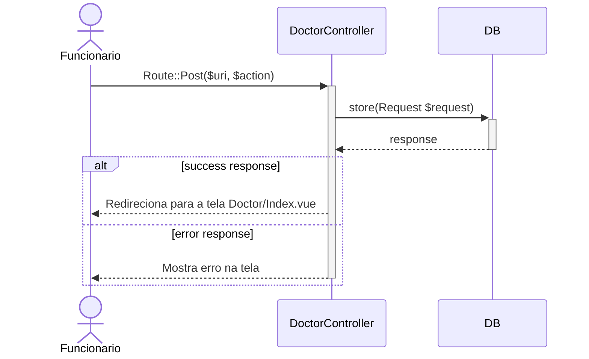
```mermaid
sequenceDiagram

actor Funcionario
Funcionario->>+DoctorController: Route::Post($uri, $action)

DoctorController->>+DB: store(Request $request)

DB-->>-DoctorController: response

alt success response
    DoctorController-->>Funcionario: Redireciona para a tela Doctor/Index.vue
else error response
    DoctorController-->>-Funcionario: Mostra erro na tela
end

```

**Buscar médico**

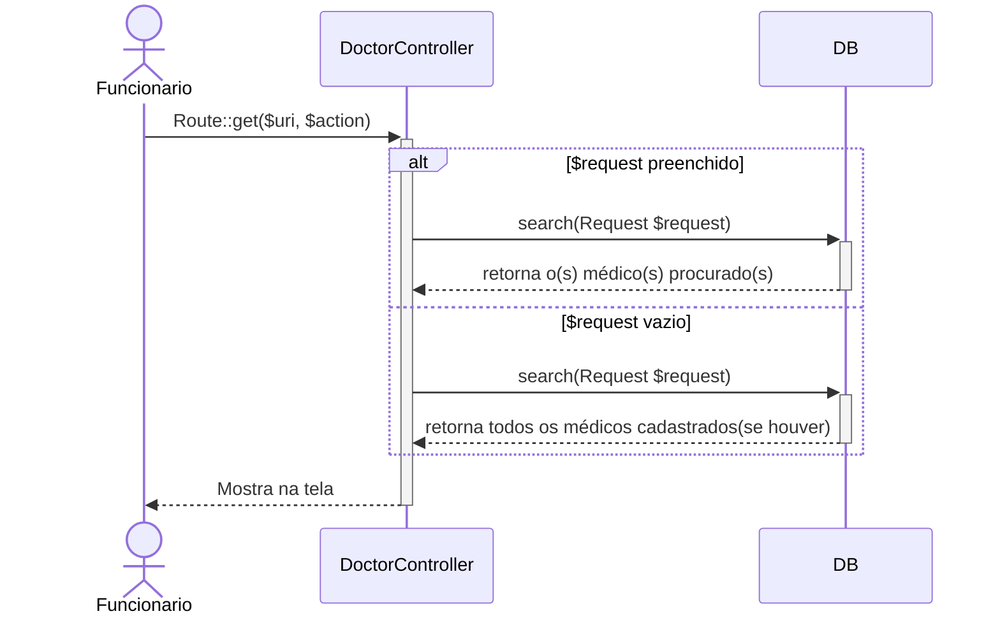
```mermaid
sequenceDiagram

actor Funcionario  

Funcionario->>+DoctorController: Route::get($uri, $action)
alt $request preenchido
DoctorController->>+DB: search(Request $request)
DB-->>-DoctorController: retorna o(s) médico(s) procurado(s)
else $request vazio
DoctorController->>+DB: search(Request $request)
DB-->>-DoctorController: retorna todos os médicos cadastrados(se houver)
end
DoctorController-->>-Funcionario: Mostra na tela

```

**Atualizar informações do médico**

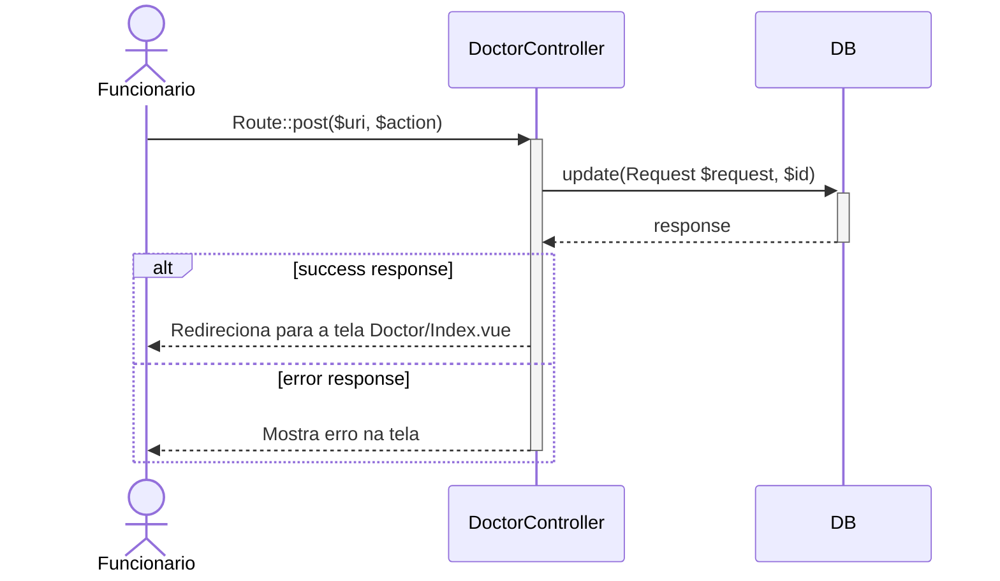
```mermaid
sequenceDiagram

actor Funcionario

Funcionario->>+DoctorController: Route::post($uri, $action)
DoctorController->>+DB: update(Request $request, $id)
DB-->>-DoctorController: response
alt success response
    DoctorController-->>Funcionario: Redireciona para a tela Doctor/Index.vue
else error response
    DoctorController-->>-Funcionario: Mostra erro na tela
end

```

#### UC005_GERENCIAR_TIPO_DE_EXAME

O caso de uso UC005_gerenciar_tipo_de_exame permite o gerenciamento dos tipos de exame no sistema, as *roles* admin, biomédico e recepcionista tem acesso ao caso de uso.

##### Telas

###### Tipos de exame

**Index**

A Figura 20 é responsável por exibir os tipos de exame cadastrados.

Figura 20

**Edit**

A Figura 21 é responsável por editar os dados dos tipos de exame cadastrados.

Figura 21

**Create**

A Figura 22 é responsável por criar novos cadastros de tipos de exame.

Figura 22

##### Diagrama de sequência

**Cadastro de Tipo de Exame**

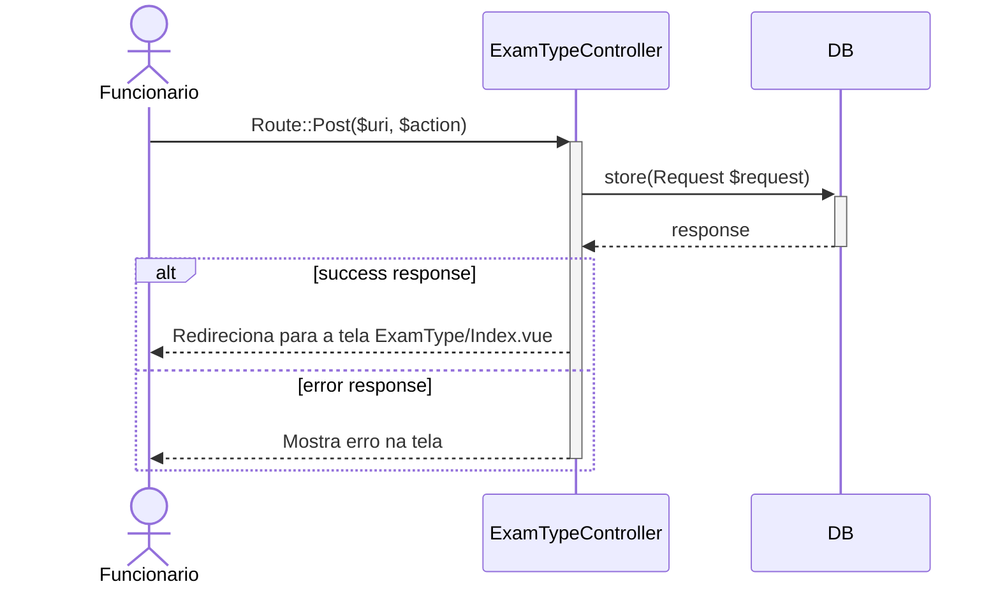
```mermaid
sequenceDiagram

actor Funcionario
Funcionario->>+ExamTypeController: Route::Post($uri, $action)

ExamTypeController->>+DB: store(Request $request)

DB-->>-ExamTypeController: response

alt success response
    ExamTypeController-->>Funcionario: Redireciona para a tela ExamType/Index.vue
else error response
    ExamTypeController-->>-Funcionario: Mostra erro na tela
end

```

**Buscar Tipo de Exame**

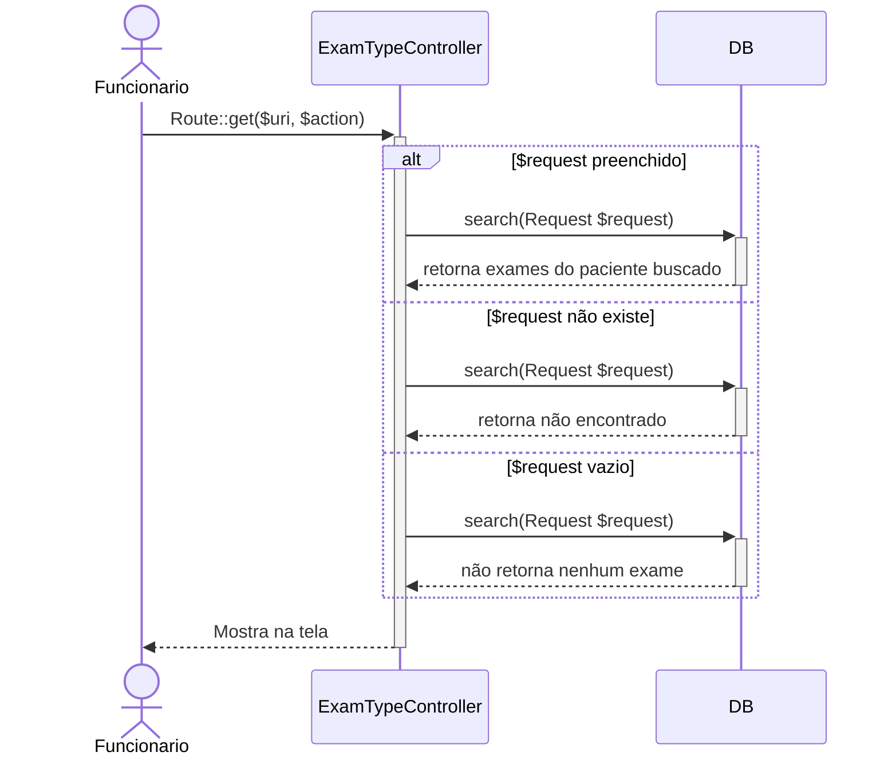
```mermaid
sequenceDiagram

actor Funcionario  

Funcionario->>+ExamTypeController: Route::get($uri, $action)
alt $request preenchido
ExamTypeController->>+DB: search(Request $request)
DB-->>-ExamTypeController: retorna exames do paciente buscado
else $request não existe
ExamTypeController->>+DB: search(Request $request)
DB-->>-ExamTypeController: retorna não encontrado
else $request vazio
ExamTypeController->>+DB: search(Request $request)
DB-->>-ExamTypeController: não retorna nenhum exame
end
ExamTypeController-->>-Funcionario: Mostra na tela

```

**Atualizar Tipo de Exame**

```mermaid
sequenceDiagram

actor Funcionario

Funcionario->>+ExamTypeController: Route::post($uri, $action)
ExamTypeController->>+DB: update(Request $request, $id)
DB-->>-ExamTypeController: response
alt success response
    ExamTypeController-->>Funcionario: Redireciona para a tela Exam/Index.vue
else error response
    ExamTypeController-->>-Funcionario: Mostra erro na tela
end

```

#### UC006_GERENCIAR_LAUDO

O caso de uso UC006_gerenciar_laudo permite o gerenciamento dos laudos dos exames de paternidade e de sangue.
Para os exames de sangue as *roles* biomédico e admin tem acesso.
Para os testes de paternidade apenas os admin tem acesso.
Os pacientes podem fazer o download dos laudos registrados nos pedidos deles.

##### Telas

###### Exames de paternidade

**Gerenciar laudos**

A Figura 23 é responsável por gerenciar os laudos do exame de paternidade.

Figura 23

**Inserir dados do exame**

As Figuras 24, 25, 26 e 27 são responsáveis pela inserção dos dados para geração do laudo de paternidade.

Figura 24

Figura 25

Figura 26

Figura 27

###### Exames de sangue

**Gerenciar laudos**

A Figura 28 é responsável pelo gerenciamento do laudo.

Figura 28

**Importar CSV**

A Figura 29 é onde ocorre a importação do arquivo CSV.

Figura 29

**Preview PDF**

As Figuras 30 e 31 mostram o preview do PDF.

Figura 30

Figura 31

##### Diagrama de sequência

**Gerar Laudo**

**Sangue**

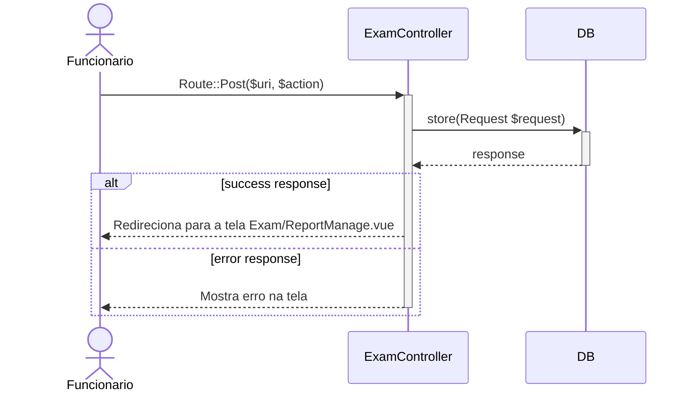
```mermaid
sequenceDiagram

actor Funcionario
Funcionario->>+ExamController: Route::Post($uri, $action)

ExamController->>+DB: store(Request $request)

DB-->>-ExamController: response

alt success response
    ExamController-->>Funcionario: Redireciona para a tela Exam/ReportManage.vue
else error response
    ExamController-->>-Funcionario: Mostra erro na tela
end

```

**Paternidade**

```mermaid
sequenceDiagram

actor Funcionario
Funcionario->>+PaternityTestController: Route::Post($uri, $action)

PaternityTestController->>+DB: store(Request $request)

DB-->>-PaternityTestController: response

alt success response
    PaternityTestController-->>Funcionario: Redireciona para a tela PaternityTest/ReportManage.vue
else error response
    PaternityTestController-->>-Funcionario: Mostra erro na tela
end

```

**Download do Laudo**

**Caso seja um funcionário**

```mermaid
sequenceDiagram

actor Usuario 

Usuario->>+ExamController: Route::get($uri, $action)
alt success
ExamController->>+DB: download_report($id)
DB-->>-ExamController: Realiza download
else error
ExamController->>+DB: dowload_report($id)
DB-->>-ExamController: Retorna mensagem
end
ExamController-->>-Usuario: Mostra mensagem

```

**Remover Laudo**

```mermaid
sequenceDiagram

actor Usuario 

Usuario->>+ExamController: Route::get($uri, $action)
alt success
ExamController->>+DB: remove_report($id)
DB-->>-ExamController: Remove e retorna mensagem
else error
ExamController->>+DB: remove_report($id)
DB-->>-ExamController: Retorna mensagem
end
ExamController-->>-Usuario: Mostra mensagem

```

## CONCLUSÕES E TRABALHOS FUTUROS

O estágio supervisionado teve como objetivo principal o desenvolvimento de um sistema de gerenciamento para uma clínica de biomedicina dentro da própria faculdade. Com base nos objetivos propostos, conseguimos atender às demandas e expectativas estabelecidas na introdução deste relatório.

Durante o estágio, o principal objetivo foi coletar e analisar os requisitos para o sistema, elaborar todos os documentos necessários e, finalmente, desenvolver o sistema utilizando as tecnologias especificadas: Laravel para o backend, Vue.js para o frontend, e Docker para a configuração e gerenciamento do banco de dados na máquina local. A utilização do GitHub foi essencial para a gestão de versionamento durante o desenvolvimento.

O aprendizado obtido com este trabalho foi considerável. A experiência prática com Laravel e Vue.js permitiu um aprofundamento significativo nas tecnologias de desenvolvimento web modernas, além de fornecer uma visão prática sobre como integrar frontend e backend de forma eficiente utilizando Inertia. O uso do Docker aprimorou minha compreensão sobre ambientes de desenvolvimento e testes, facilitando a configuração e o isolamento do banco de dados. Além disso, o trabalho com GitHub reforçou a importância do controle de versão e da colaboração em projetos de desenvolvimento de software.

A contribuição real deste projeto vai além do simples desenvolvimento do sistema. Ele proporcionou uma solução prática e personalizada para as necessidades de gerenciamento da clínica de biomedicina, melhorando a eficiência dos processos internos e a organização dos dados. A aplicação das tecnologias modernas e práticas recomendadas de desenvolvimento não só atendeu aos requisitos do projeto, mas também elevou o nível de profissionalismo e funcionalidade do sistema.

Para estudos futuros, existe a possibilidade de implementação de recursos adicionais, como integração com sistemas de agendamento e lembretes automatizados, além da inclusão de módulos de análise e relatórios mais avançados. A integração com APIs externas para otimização de processos podem também ser exploradas para aumentar ainda mais a funcionalidade e a inteligência do sistema.

Em conclusão, o estágio supervisionado foi uma oportunidade valiosa para aplicar conhecimentos teóricos em um projeto prático, obter experiência com tecnologias de ponta e contribuir com uma solução concreta para a gestão de uma clínica de biomedicina. A experiência adquirida e as contribuições realizadas foram significativas.

## REFERÊNCIAS

O que é um diagrama entidade relacionamento? Disponível em: <https://www.lucidchart.com/pages/pt/o-que-e-diagrama-entidade-relacionamento>. Acesso em: 31 ago. 2024.

TYBEL, D. Diagrama de classes (UML): Orientações básicas na elaboração. Disponível em: <https://www.devmedia.com.br/orientacoes-basicas-na-elaboracao-de-um-diagrama-de-classes/37224>. Acesso em: 31 ago. 2024.

## APÊNDICE

### ARTEFATOS DE REQUISITOS

#### [Documento de Visão](https://github.com/UniFil-NPI/projeto_analises_clinicas-GuilhermeRFVieira/blob/main/docs/visao.md)

#### [Especificação Suplementar](https://github.com/UniFil-NPI/projeto_analises_clinicas-GuilhermeRFVieira/blob/main/docs/especificacao_suplementar.md)

#### Especificações de Caso de Uso:

- ##### [UC001_GERENCIAR_USUARIO](https://github.com/UniFil-NPI/projeto_analises_clinicas-GuilhermeRFVieira/blob/main/docs/especificacoes_caso_de_uso/UC001_gerenciar_usuario.md)

- ##### [UC002_gerenciar_pedido_do_exame_de_sangue](https://github.com/UniFil-NPI/projeto_analises_clinicas-GuilhermeRFVieira/blob/main/docs/especificacoes_caso_de_uso/UC002_gerenciar_pedido_do_exame_de_sangue.md)

- ##### [UC002_gerenciar_pedido_do_exame_de_paternidade](https://github.com/UniFil-NPI/projeto_analises_clinicas-GuilhermeRFVieira/blob/main/docs/especificacoes_caso_de_uso/UC002_gerenciar_pedido_do_exame_de_sangue.md)

- ##### [UC004_GERENCIAR_MEDICO](https://github.com/UniFil-NPI/projeto_analises_clinicas-GuilhermeRFVieira/blob/main/docs/especificacoes_caso_de_uso/UC004_gerenciar_medico.md)

- ##### [UC005_GERENCIAR_TIPO_DE_EXAME](https://github.com/UniFil-NPI/projeto_analises_clinicas-GuilhermeRFVieira/blob/main/docs/especificacoes_caso_de_uso/UC005_gerenciar_tipo_de_exame.md)

- ##### [UC006_GERENCIAR_LAUDO](https://github.com/UniFil-NPI/projeto_analises_clinicas-GuilhermeRFVieira/blob/main/docs/especificacoes_caso_de_uso/UC006_gerenciar_laudo.md)

#### [Glossário](https://github.com/UniFil-NPI/projeto_analises_clinicas-GuilhermeRFVieira/blob/main/docs/glossario.md)

#### [Pedidos do Investidor](https://github.com/UniFil-NPI/projeto_analises_clinicas-GuilhermeRFVieira/blob/main/docs/pedido_investidor.md)

### DIAGRAMAS

#### [Diagrama de Caso de Uso](https://github.com/UniFil-NPI/projeto_analises_clinicas-GuilhermeRFVieira/blob/main/docs/caso_de_uso.md)

#### [Diagrama de Classes](https://github.com/UniFil-NPI/projeto_analises_clinicas-GuilhermeRFVieira/blob/main/docs/diagrama_de_classes.md)

#### [Diagrama de Entidade e Relacionamento](https://github.com/UniFil-NPI/projeto_analises_clinicas-GuilhermeRFVieira/blob/main/docs/DER.md)

#### Diagramas de Estado:

- ##### [UC002_gerenciar_pedido_do_exame_de_sangue](https://github.com/UniFil-NPI/projeto_analises_clinicas-GuilhermeRFVieira/blob/main/docs/diagramas_de_estado/UC002_gerenciar_pedido_do_exame_de_sangue.md)

#### [Diagrama de Implantação](https://github.com/UniFil-NPI/projeto_analises_clinicas-GuilhermeRFVieira/blob/main/docs/diagrama_de_implantacao.md)

#### Diagramas de Sequência:

- ##### [UC001_GERENCIAR_USUARIO](https://github.com/UniFil-NPI/projeto_analises_clinicas-GuilhermeRFVieira/blob/main/docs/diagramas_de_sequencia/UC001_gerenciar_usuario.md)

- ##### [UC002_gerenciar_pedido_do_exame_de_sangue](https://github.com/UniFil-NPI/projeto_analises_clinicas-GuilhermeRFVieira/blob/main/docs/diagramas_de_sequencia/UC002_gerenciar_pedido_do_exame_de_sangue.md)

- ##### [UC004_GERENCIAR_MEDICO](https://github.com/UniFil-NPI/projeto_analises_clinicas-GuilhermeRFVieira/blob/main/docs/diagramas_de_sequencia/UC004_gerenciar_medico.md)

- ##### [UC005_GERENCIAR_TIPO_DE_EXAME](https://github.com/UniFil-NPI/projeto_analises_clinicas-GuilhermeRFVieira/blob/main/docs/diagramas_de_sequencia/UC005_gerenciar_tipo_de_exame.md)

- ##### [UC006_GERENCIAR_LAUDO](https://github.com/UniFil-NPI/projeto_analises_clinicas-GuilhermeRFVieira/blob/main/docs/diagramas_de_sequencia/UC006_gerenciar_laudo.md)

#### [Workflow AS-IS](https://github.com/UniFil-NPI/projeto_analises_clinicas-GuilhermeRFVieira/blob/main/docs/workflow_asis.md)

#### [Workflow TO-BE](https://github.com/UniFil-NPI/projeto_analises_clinicas-GuilhermeRFVieira/blob/main/docs/workflow_to_be.md)

---

[Voltar](README.md)
