CURSO DE BACHARELADO EM ENGENHARIA DE SOFTWARE\
GUILHERME RAFAEL FARACO VIEIRA\
Mario Henrique Akihiko da Costa Adaniya\
PROJETO DE ANÁLISES CLÍNICAS\
Londrina\
2024
===

## SUMÁRIO

1. [AGRADECIMENTOS](#agradecimentos)
   
2. [INTRODUÇÃO](#introdução)
   
3. [DESCRIÇÃO DO SISTEMA](#descrição-do-sistema)
   
4. [MODELAGEM DO SISTEMA](#modelagem-do-sistema)
   
  1. [DIAGRAMA DE CASO DE USO](#diagrama-de-caso-de-uso)
   
  2. [DIAGRAMA DE CLASSE](#diagrama-de-classe)
   
  3. [DIAGRAMA DE ENTIDADE E RELACIONAMENTO](#diagrama-de-entidade-e-relacionamento)
  
  4. [CASOS DE USO](#casos-de-uso)
     
     1. [UC001_GERENCIAR_USUARIO](#uc001_gerenciar_usuario)
     
     2. [UC002_GERENCIAR_PEDIDO_DO_EXAME](#uc002_gerenciar_pedido_do_exame)
     
     3. [UC003_GERENCIAR_MEDICO](#uc003_gerenciar_medico)
   
5. [CONCLUSÕES E TRABALHOS FUTUROS](#conclusões-e-trabalhos-futuros)

6. [REFERÊNCIAS](#referências)
   
7. [APÊNDICE](#apêncice)
   
   1. [ARTEFATOS DE REQUISITOS](#artefatos-de-requisitos)
   
   2. [DIAGRAMAS](#diagramas)

## AGRADECIMENTOS

Neste momento de conclusão do meu estágio, sinto-me profundamente grato por todo o apoio e orientação que recebi ao longo dessa jornada.

Primeiramente, gostaria de expressar meu sincero agradecimento ao meu professor orientador, Mario. Sua orientação, paciência e conselhos valiosos foram fundamentais para o desenvolvimento deste trabalho e para meu crescimento pessoal e profissional. Agradeço pelo tempo dedicado, e por todo o apoio durante esse ano. 

Aos meus colegas da área, meu muito obrigado. Que durante os tempos difíceis estivemos em contato ajudando uns aos outros.

Por fim, agradeço a Deus por me guiar e iluminar em todos os momentos desta jornada.

## INTRODUÇÃO

Este sistema será desenvolvido por Guilherme Rafael Faraco Vieira aluno do curso de bacharelado em Engenharia de Software e participante do Núcleo de Práticas em Informática(NPI).

O NPI é um grupo que pertence a UniFil, onde os alunos aprendem utilizando a prática, criado com o título de Empresa Júnior, com intuito de efetivar os conhecimentos do curso desenvolvendo projetos para a instituição, que contribuem imensamente com o aprendizado dos participantes. Vale ressaltar que os projetos no NPI são sem fins lucrativos, apenas para apredizado.

O sistema proposto ao laboratório da UniFil é uma aplicação *Web* onde conterá informações relevantes para que os pacientes entendam sobre os exames e como funciona a clínica no geral. Dentro dessa aplicação serão gerados de forma automatizada os laudos dos exames de sangue e dos testes de paternidade, também possibilitará os usuários manterem um controle dos usuários e laudos de forma fácil.

O laboratório de análises clínicas está em fase inicial, os exames ainda não estão sendo feitos em quaisquer pacientes, apenas em alguns selecionados para fim de estudos, sendo assim o laboratório necessita do Sistema de Análises Clínicas ofertado, para que não seja necessário realizar todos os processos, desde o cadastro, de forma manual.

## DESCRIÇÃO DO SISTEMA

O objetivo deste projeto é prover uma aplicação *Web* que funcionará como um sistema de laboratório 24 horas por dia e todos os dias da semana com uma tela inicial explicando sobre o funcionamento da clínica e sobre os exames feitos.

- A aplicação deverá conter o gerenciamento dos usuários.

- Uma forma de colher as informações geradas pelo Analisador Hematológico que é responsável por fazer as análises do sangue.

- Um local para que o responsável pela realização do teste de paternidade possa inserir os dados gerados pela análise da amostras biológicas da mãe, filho e suposto pai.

- No exame de sangue o sistema será responsável por gerar um laudo selecionando os dados colhidos do Analisador Hematológico com base no tipo de exame pedido pelo médico do paciente. Os laudos possuirão um padrão a ser seguido.

- No teste de paternidade, será primeiramente selecionado o tipo de teste, podendo ser em trio(mãe, requerente - filho(a), suposto pai investigado), duo(requerente - filho(a), suposto pai investigado) e de reconstituição(podendo ser várias pessoas da família, ex: avós ou outra família), após a seleção do tipo de teste de paternidade, serão feito os cadastros de cada participante e então colhidos as amostras biológicas e então o responsável pelo teste de paternidade irá inserir os dados necessários para realização do teste, esse exame é realizado por meio de algumas fórmulas matemáticas que serão executadas pelo próprio sistema.

- Um local onde os usuários tenham acesso aos laudos, contendo um filtro para que fique mais simples de buscar o exame desejado e opções de *download* e compartilhamento do laudo selecionado.

### *FRONT-END*

No *Front-end* do sistema as tecnologias utilizadas serão:

- ***HTML5***, Linguagem de Marcação de HiperTexto, responsável por definir a estrutura do conteúdo da *Web*;

- ***CSS3***, *Cascading Style Sheets*, responsável por descrever como o conteúdo será exibido na tela;

- ***JavaScript***, conhecida como linguagem de script para páginas *Web*, é uma linguagem interpretada baseada em protótipos, multiparadigma e dinâmica;

- ***[Vue.js](https://vuejs.org/)*** v3, um framework de criação de interfaces de usuário na Web;

- ***[Node.js](https://nodejs.org/en)*** v20.12.0;

- ***[npm](https://www.npmjs.com/)*** v10.5.0;

- ***[Tailwind CSS](https://tailwindcss.com/)*** v3.4.3;

- ***[PrimeVue](https://primevue.org/)*** v4.0.4

### *BACK-END*

No *Back-end* do sistema as técnologias utilizadas serão:

- ***[Laravel 11](https://laravel.com/)***, um *framework* para construir aplicações *Web*.

- ***[InertiaJS](https://inertiajs.com/)***, permite o usuário criar inteiramente um *single-page app* cliente-servidor renderizado sem precisar de uma API.

### BANCO DE DADOS

Será utilizado o sistema de gerenciamento de banco de dados ***[PostgreSQL](https://www.postgresql.org/)*** v16.

### DIAGRAMAÇÃO

Para realizar os diagramas foi utilizado as seguintes ferramentas:

- ***[draw.io](https://www.drawio.com/)***

- ***[HEFLO](https://www.heflo.com/pt-br/)***

- ***[Mermaid](https://mermaid.js.org/)***

### PROTOTIPAÇÃO

Para a prototipação do projeto foi utilizado uma ferramenta *Web* chamada ***[Figma](https://www.figma.com)***.

## MODELAGEM DO SISTEMA

### DIAGRAMA DE CASO DE USO

O diagrama de caso de uso tem como finalidade descrever os requisitos funcionais do sistema proposto e a relação dos usuários do sistema com relação aos requisitos colhidos.

A Figura 1 refere-se ao diagrama de caso de uso do sistema de Análises Clínicas.

Figura 1

### DIAGRAMA DE CLASSE

O diagrama de classes é uma ferramenta essencial na modelagem orientada a objetos, proporcionando uma visão detalhada e estruturada do sistema que é crucial para o desenvolvimento de software eficiente e bem-organizado.

A Figura 2 refere-se ao diagrama de classe do sistema de Análises Clínicas.

Figura 2

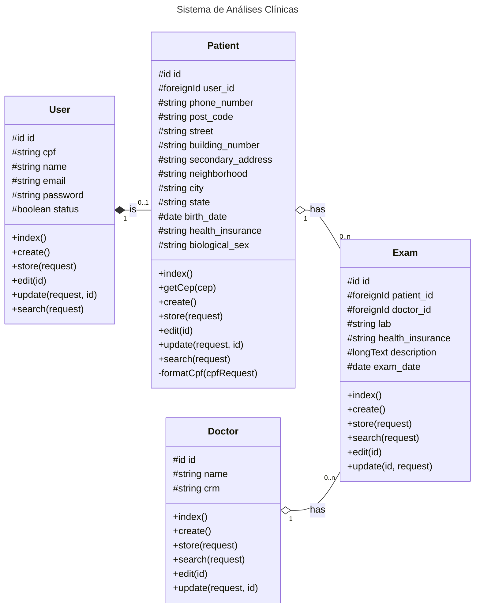
```mermaid
---
title: Sistema de Análises Clínicas
---
classDiagram

direction LR

User "1" *-- "0..1" Patient : is

class User {
    #id id
    #string cpf 
    #string name
    #string email
    #string password
    #boolean status
    +index()
    +create()
    +store(request)
    +edit(id)
    +update(request, id)
    +search(request)
}

Patient "1" o-- "0..n" Exam : has

class Patient{
    #id id
    #foreignId user_id
    #string phone_number
    #string post_code
    #string street
    #string building_number
    #string secondary_address
    #string neighborhood
    #string city
    #string state
    #date birth_date
    #string health_insurance
    #string biological_sex
    +index()
    +getCep(cep)
    +create()
    +store(request)
    +edit(id)
    +update(request, id)
    +search(request)
    -formatCpf(cpfRequest)
}

class Exam {
    #id id
    #foreignId patient_id
    #foreignId doctor_id
    #string lab
    #string health_insurance
    #longText description
    #date exam_date
    +index()
    +create()
    +store(request)
    +search(request)
    +edit(id)
    +update(id, request)

}

Doctor "1" o-- "0..n" Exam : has

class Doctor {
    #id id
    #string name
    #string crm
    +index()
    +create()
    +store(request)
    +search(request)
    +edit(id)
    +update(request, id)
}


```

### DIAGRAMA DE ENTIDADE E RELACIONAMENTO

O diagrama ER é uma ferramenta crucial na modelagem de dados, permitindo que você visualize e organize as informações de forma estruturada e lógica, o que é essencial para o design e implementação eficaz de sistemas de banco de dados.

A Figura 3 refere-se ao diagrama de entidade e relacionamento do sistema de Análises Clínicas.

Figura 3

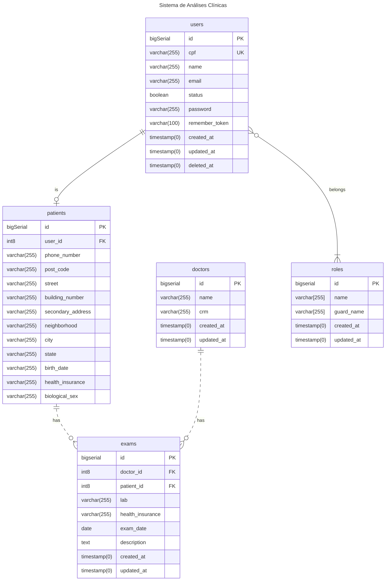
```mermaid
---
title: Sistema de Análises Clínicas
---
erDiagram

users only one -- zero or one patients : is
users {
    bigSerial id PK
    varchar(255) cpf UK
    varchar(255) name
    varchar(255) email
    boolean status
    varchar(255) password
    varchar(100) remember_token
    timestamp(0) created_at
    timestamp(0) updated_at
    timestamp(0) deleted_at
}


patients only one .. zero or many exams : has
patients {
    bigSerial id PK
    int8 user_id FK
    varchar(255) phone_number
    varchar(255) post_code
    varchar(255) street
    varchar(255) building_number
    varchar(255) secondary_address
    varchar(255) neighborhood
    varchar(255) city
    varchar(255) state
    varchar(255) birth_date
    varchar(255) health_insurance
    varchar(255) biological_sex

}
exams {
    bigserial id PK
    int8 doctor_id FK
    int8 patient_id FK
    varchar(255) lab
    varchar(255) health_insurance
    date exam_date
    text description
    timestamp(0) created_at
    timestamp(0) updated_at
    
}

doctors only one .. zero or many exams : has
doctors {
    bigserial id PK
    varchar(255) name
    varchar(255) crm
    timestamp(0) created_at
    timestamp(0) updated_at
}

users zero or many -- one or many roles : belongs


roles {
    bigserial id PK
    varchar[255] name
    varchar[255] guard_name
    timestamp(0) created_at
    timestamp(0) updated_at

}

```

### CASOS DE USO

#### UC001_GERENCIAR_USUARIO

O caso de uso gerenciar_usuario, permite o gerenciamento de todos as roles de usuário, onde apenas o admin tem acesso, A única excessão é a *role* paciente, que poderá ser editada pela recepcionista.

##### Telas

A Figura 4 refere-se à tela de busca de funcionários.

Figura 4

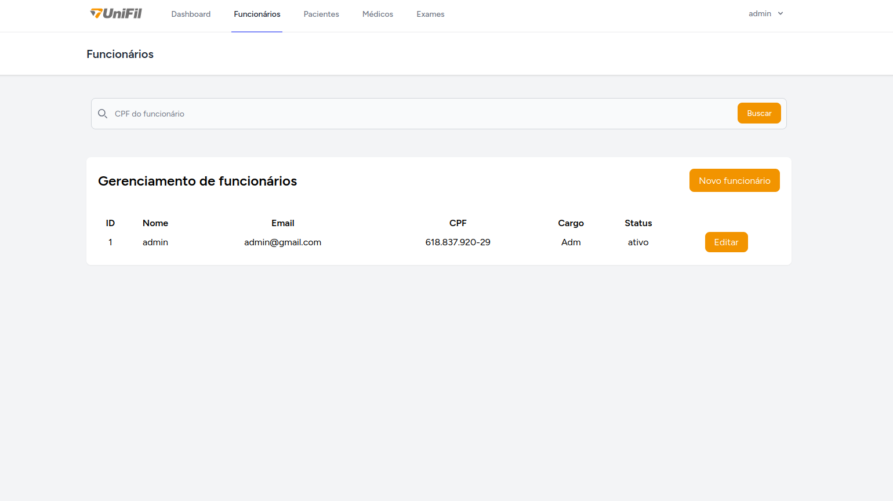

A Figura 5 refere-se à tela de edição dos dados do funcionário.

Figura 5

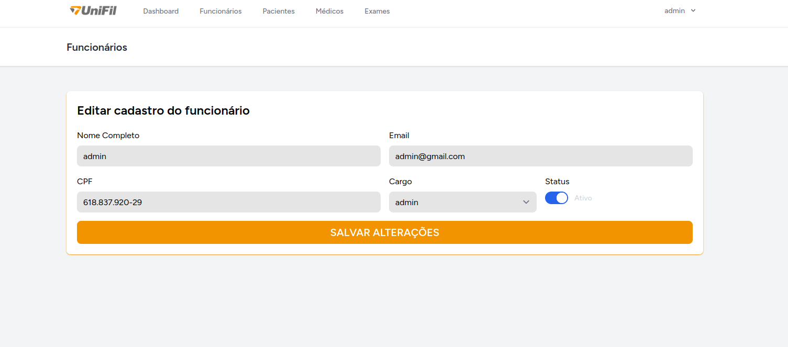

A Figura 6 refere-se à tela de criação de um novo cadastro de funcionário.

Figura 6

A Figura 7 refere-se à tela de busca de pacientes.

Figura 7

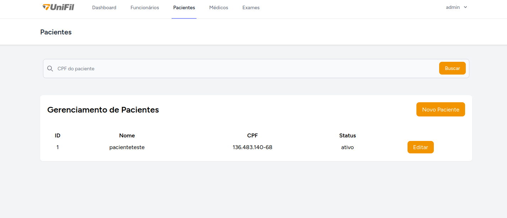

A Figura 8 refere-se à tela de criação de um novo cadastro de paciente.

Figura 8

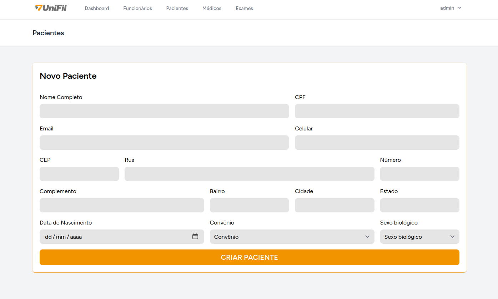

A Figura 9 refere-se à tela de edição dos dados do paciente.

Figura 9

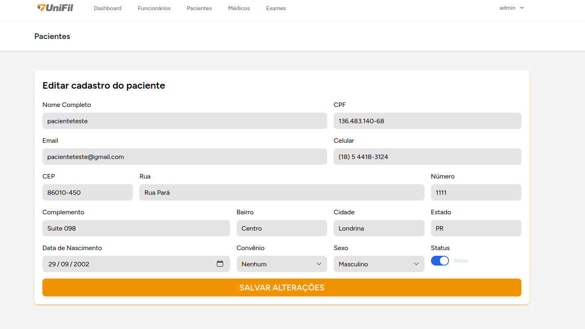

##### Diagrama de sequência

###### Cadastro de Usuário

A Figura 10 refere-se ao diagrama de sequência da parte de criação de um novo cadastro de usuário.

Figura 10

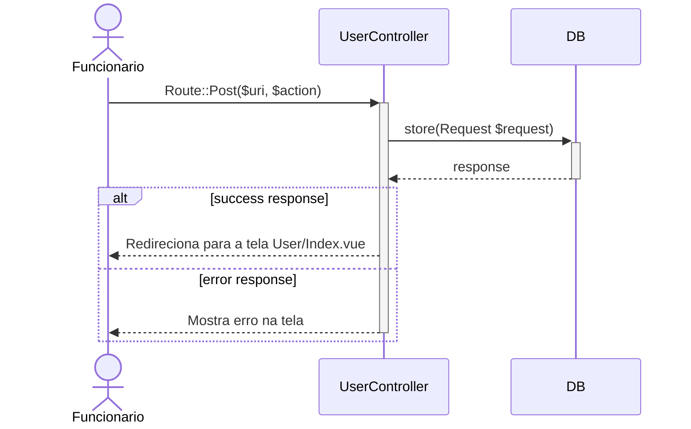
```mermaid
sequenceDiagram

actor Funcionario
Funcionario->>+UserController: Route::Post($uri, $action)

UserController->>+DB: store(Request $request)

DB-->>-UserController: response

alt success response
    UserController-->>Funcionario: Redireciona para a tela User/Index.vue
else error response
    UserController-->>-Funcionario: Mostra erro na tela
end

```

###### Buscar Usuário

A Figura 11 refere-se ao diagrama de sequência da parte de busca de usuário.

Figura 11

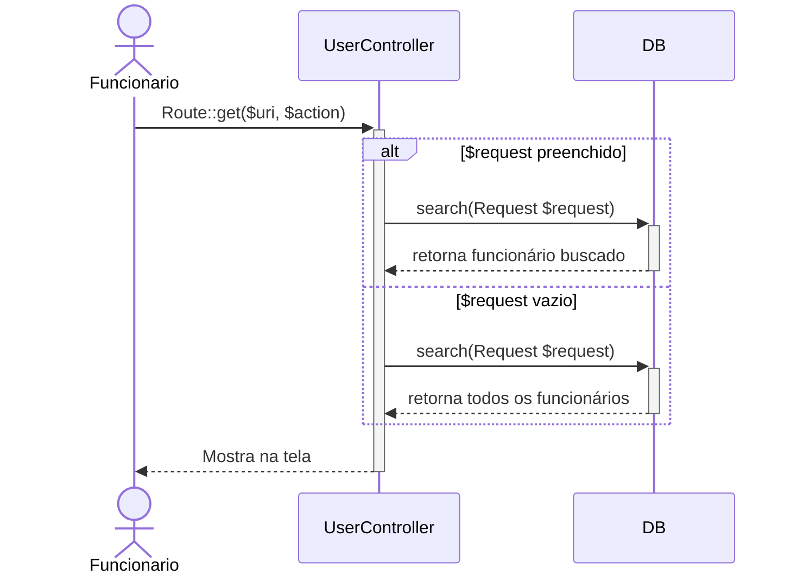
```mermaid
sequenceDiagram

actor Funcionario  

Funcionario->>+UserController: Route::get($uri, $action)
alt $request preenchido
UserController->>+DB: search(Request $request)
DB-->>-UserController: retorna funcionário buscado
else $request vazio
UserController->>+DB: search(Request $request)
DB-->>-UserController: retorna todos os funcionários
end
UserController-->>-Funcionario: Mostra na tela

```

###### Atualizar Cadastro

A Figura 12 refere-se ao diagrama de sequência da parte de atualização dos dados do usuário.

Figura 12

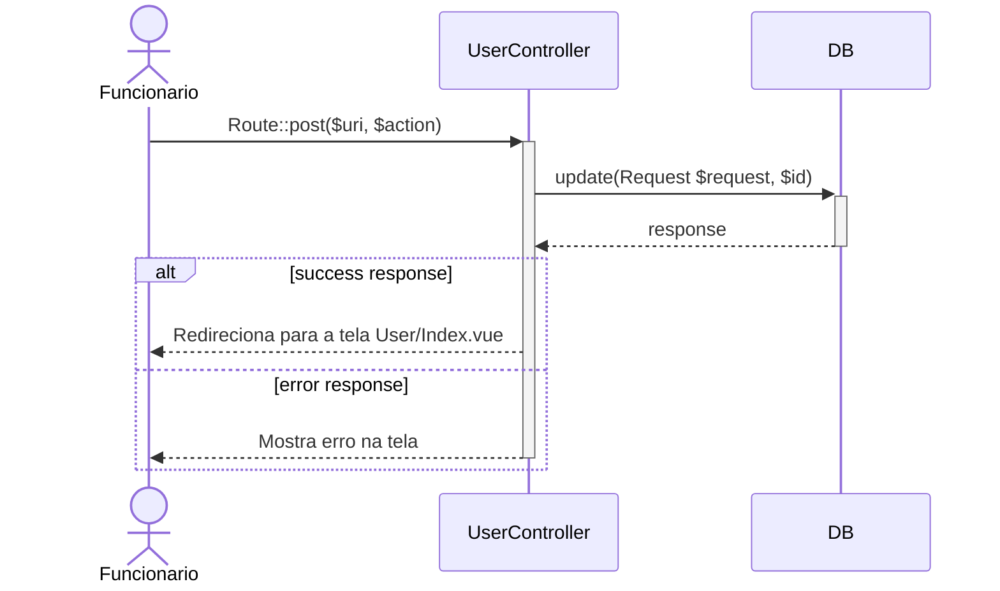
```mermaid
sequenceDiagram

actor Funcionario

Funcionario->>+UserController: Route::post($uri, $action)
UserController->>+DB: update(Request $request, $id)
DB-->>-UserController: response
alt success response
    UserController-->>Funcionario: Redireciona para a tela User/Index.vue
else error response
    UserController-->>-Funcionario: Mostra erro na tela
end

```

#### UC002_GERENCIAR_PEDIDO_DO_EXAME

O caso de uso UC002_gerenciar_pedido_do_exame, permite o gerenciamento dos pedidos dos exames, onde apenas o admin e o recepcionista tem acesso.

##### Telas

A Figura 13 refere-se à tela de busca de pedidos de exames sem ter pesquisado nenhum CPF.

Figura 13

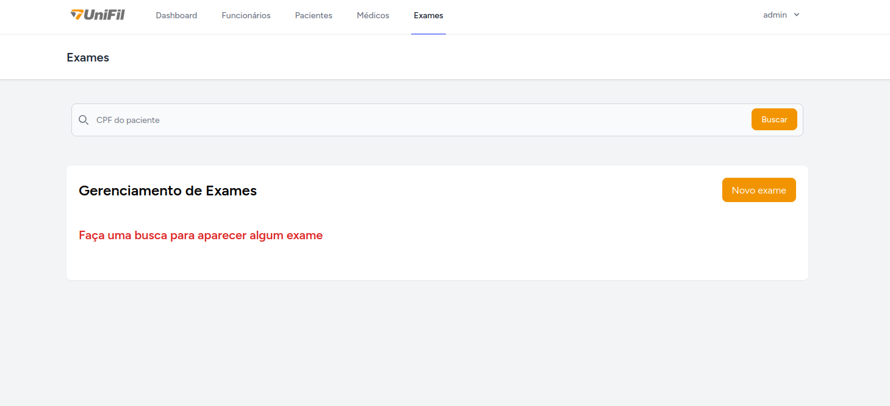

A Figura 14 refere-se à tela de criação de um novo pedido de exame.

Figura 14

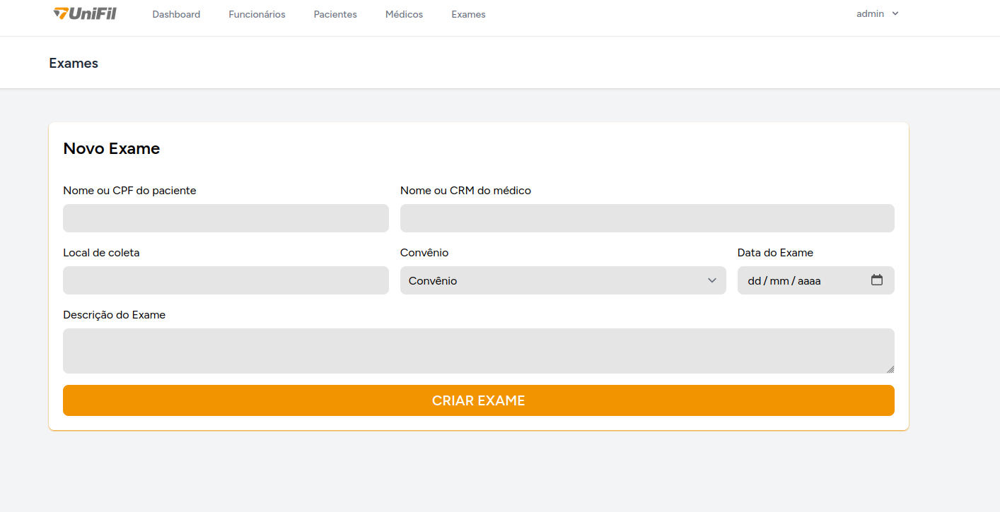

A Figura 15 refere-se à tela de busca de pedidos de exames tendo feito uma busca dos exames de determinado paciente.

Figura 15

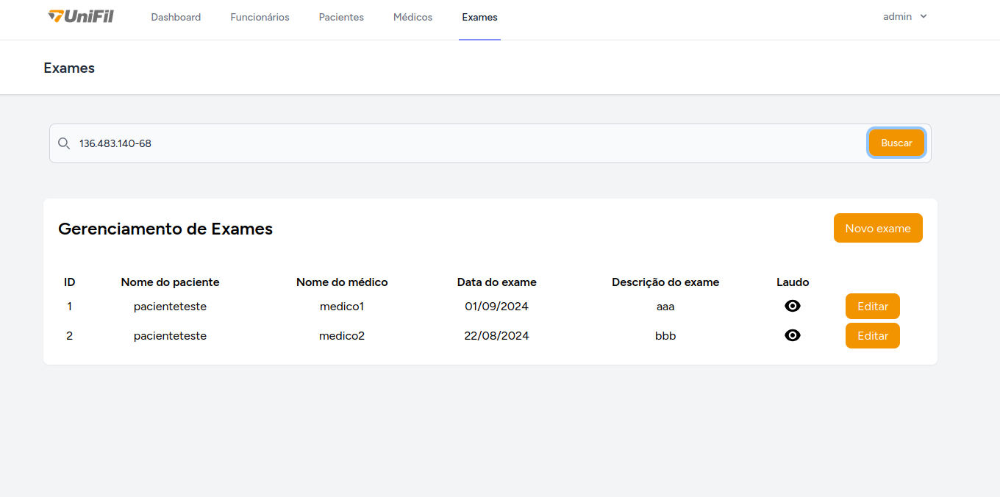

A Figura 16 refere-se à tela de edição de um pedido de exame.

Figura 16

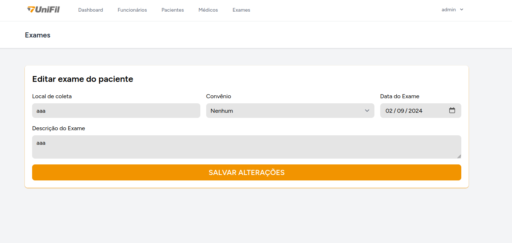

##### Diagrama de sequência

###### Cadastro de Pedido

A Figura 17 refere-se ao diagrama de sequência da parte cadastro de um novo pedido de exame.

Figura 17

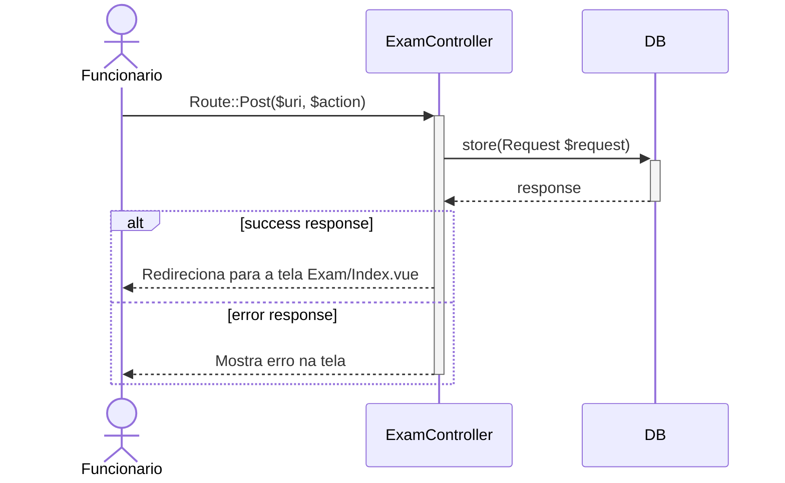
```mermaid
sequenceDiagram

actor Funcionario
Funcionario->>+ExamController: Route::Post($uri, $action)

ExamController->>+DB: store(Request $request)

DB-->>-ExamController: response

alt success response
    ExamController-->>Funcionario: Redireciona para a tela Exam/Index.vue
else error response
    ExamController-->>-Funcionario: Mostra erro na tela
end

```

###### Buscar pedidos caso seja um funcionário

A Figura 18 refere-se ao diagrama de sequência da parte de busca de exames caso seja um funcionário logado.

Figura 18

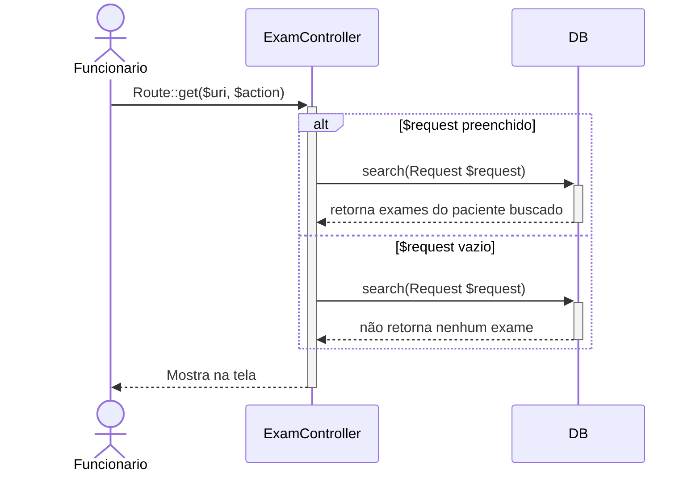
```mermaid
sequenceDiagram

actor Funcionario  

Funcionario->>+ExamController: Route::get($uri, $action)
alt $request preenchido
ExamController->>+DB: search(Request $request)
DB-->>-ExamController: retorna exames do paciente buscado
else $request vazio
ExamController->>+DB: search(Request $request)
DB-->>-ExamController: não retorna nenhum exame
end
ExamController-->>-Funcionario: Mostra na tela

```

###### Buscar pedidos caso seja um paciente

A Figura 19 refere-se ao diagrama de sequência da parte de busca de exames caso seja um paciente logado.

Figura 19

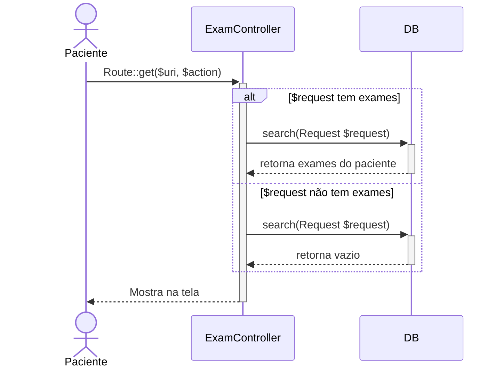
```mermaid
sequenceDiagram

actor Paciente  

Paciente->>+ExamController: Route::get($uri, $action)
alt $request tem exames
ExamController->>+DB: search(Request $request)
DB-->>-ExamController: retorna exames do paciente
else $request não tem exames
ExamController->>+DB: search(Request $request)
DB-->>-ExamController: retorna vazio
end
ExamController-->>-Paciente: Mostra na tela

```

###### Atualizar Pedido

A Figura 20 refere-se ao diagrama de sequência da parte de edição dos dados do pedido.

Figura 20

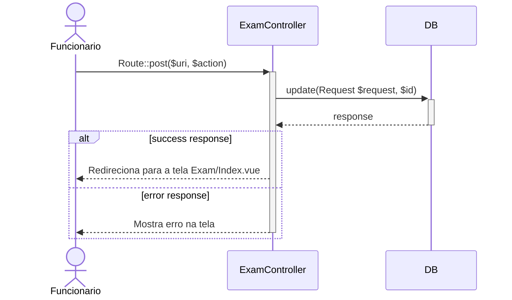
```mermaid
sequenceDiagram

actor Funcionario

Funcionario->>+ExamController: Route::post($uri, $action)
ExamController->>+DB: update(Request $request, $id)
DB-->>-ExamController: response
alt success response
    ExamController-->>Funcionario: Redireciona para a tela Exam/Index.vue
else error response
    ExamController-->>-Funcionario: Mostra erro na tela
end

```

#### UC003_GERENCIAR_MEDICO

O caso de uso UC003_gerenciar_medico permite o gerenciamento dos médicos cadastrados no sistema, apenas o admin e o recepcionista tem acesso ao caso de uso.

##### Telas

A Figura 21 refere-se à tela de busca de pedidos de médicos cadastrados.

Figura 21

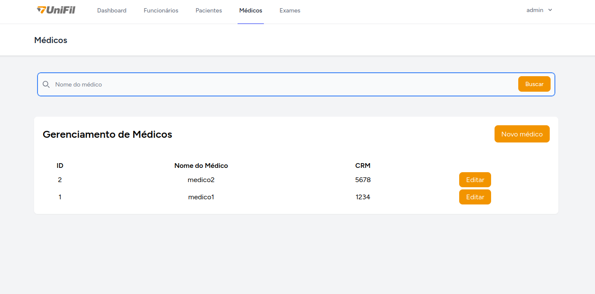

A Figura 22 refere-se à tela de criação de cadastro de médico.

Figura 22

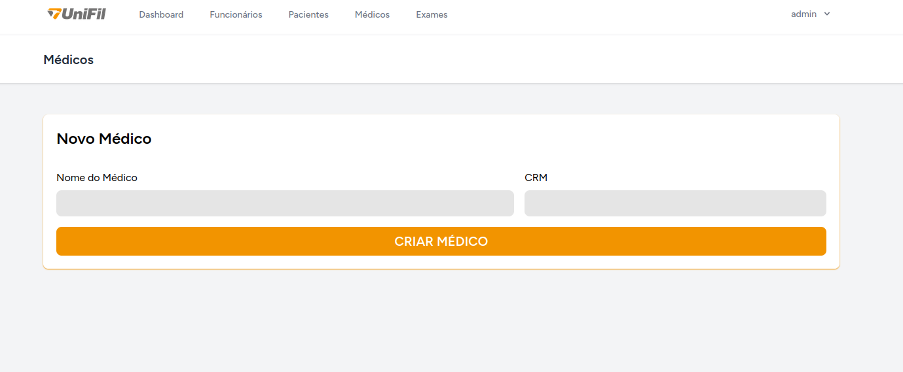

A Figura 23 refere-se à tela de edição dos dados de um médico.

Figura 23

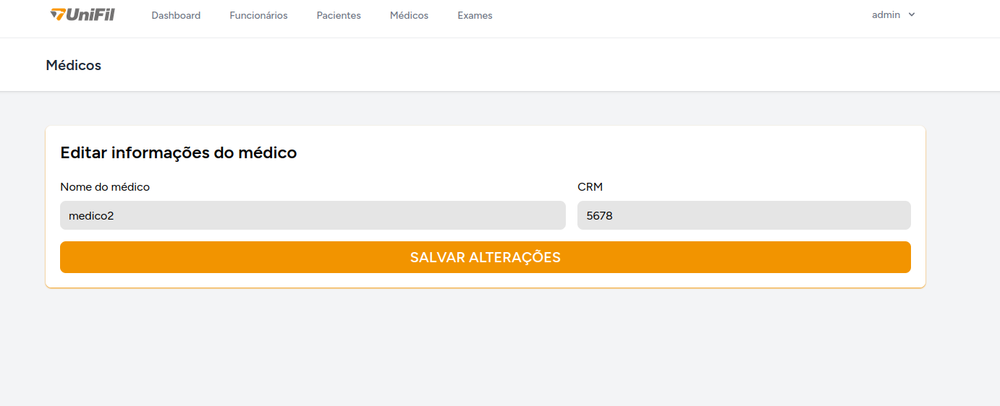

##### Diagrama de sequência

###### Cadastrar médico

A Figura 24 refere-se ao diagrama de sequência da parte cadastro de um médico.

Figura 24

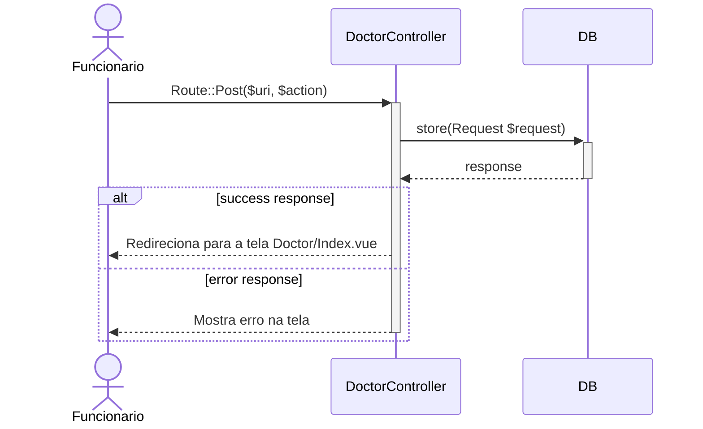
```mermaid
sequenceDiagram

actor Funcionario
Funcionario->>+DoctorController: Route::Post($uri, $action)

DoctorController->>+DB: store(Request $request)

DB-->>-DoctorController: response

alt success response
    DoctorController-->>Funcionario: Redireciona para a tela Doctor/Index.vue
else error response
    DoctorController-->>-Funcionario: Mostra erro na tela
end

```

###### Buscar médico

A Figura 25 refere-se ao diagrama de sequência da parte de buscar um médico no sistema.

Figura 25

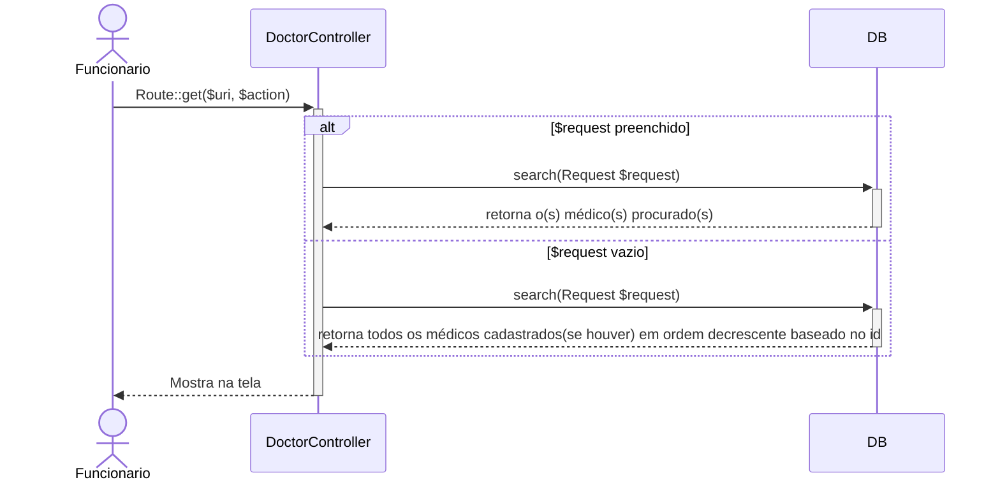
```mermaid
sequenceDiagram

actor Funcionario  

Funcionario->>+DoctorController: Route::get($uri, $action)
alt $request preenchido
DoctorController->>+DB: search(Request $request)
DB-->>-DoctorController: retorna o(s) médico(s) procurado(s)
else $request vazio
DoctorController->>+DB: search(Request $request)
DB-->>-DoctorController: retorna todos os médicos cadastrados(se houver) em ordem decrescente baseado no id
end
DoctorController-->>-Funcionario: Mostra na tela

```

###### Atualizar cadastro de um médico

A Figura 26 refere-se ao diagrama de sequência da parte de edição dos dados de um médico.

Figura 26

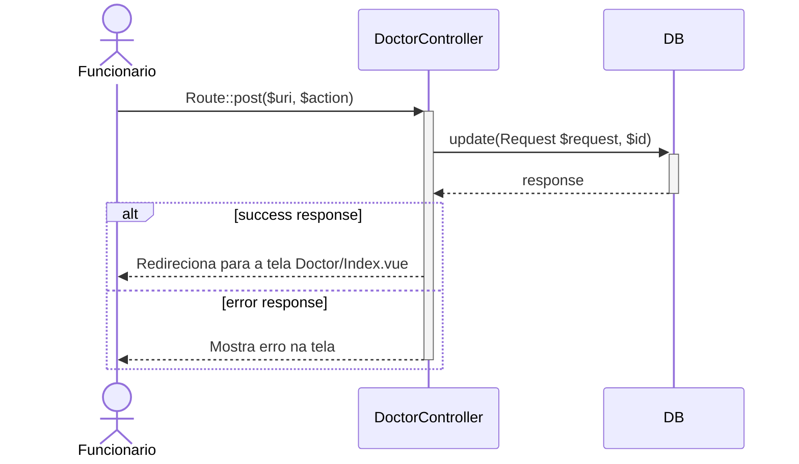
```mermaid
sequenceDiagram

actor Funcionario

Funcionario->>+DoctorController: Route::post($uri, $action)
DoctorController->>+DB: update(Request $request, $id)
DB-->>-DoctorController: response
alt success response
    DoctorController-->>Funcionario: Redireciona para a tela Doctor/Index.vue
else error response
    DoctorController-->>-Funcionario: Mostra erro na tela
end

```

## CONCLUSÕES E TRABALHOS FUTUROS

O estágio supervisionado teve como objetivo principal o desenvolvimento de um sistema de gerenciamento para uma clínica de biomedicina dentro da própria faculdade. Com base nos objetivos propostos, conseguimos atender às demandas e expectativas estabelecidas na introdução deste relatório.

Durante o estágio, o principal objetivo foi coletar e analisar os requisitos para o sistema, elaborar todos os documentos necessários e, finalmente, desenvolver o sistema utilizando as tecnologias especificadas: Laravel para o backend, Vue.js para o frontend, e Docker para a configuração e gerenciamento do banco de dados na máquina local. A utilização do GitHub foi essencial para a gestão de versionamento durante o desenvolvimento.

O aprendizado obtido com este trabalho foi considerável. A experiência prática com Laravel e Vue.js permitiu um aprofundamento significativo nas tecnologias de desenvolvimento web modernas, além de fornecer uma visão prática sobre como integrar frontend e backend de forma eficiente utilizando Inertia. O uso do Docker aprimorou minha compreensão sobre ambientes de desenvolvimento e testes, facilitando a configuração e o isolamento do banco de dados. Além disso, o trabalho com GitHub reforçou a importância do controle de versão e da colaboração em projetos de desenvolvimento de software.

A contribuição real deste projeto vai além do simples desenvolvimento do sistema. Ele proporcionou uma solução prática e personalizada para as necessidades de gerenciamento da clínica de biomedicina, melhorando a eficiência dos processos internos e a organização dos dados. A aplicação das tecnologias modernas e práticas recomendadas de desenvolvimento não só atendeu aos requisitos do projeto, mas também elevou o nível de profissionalismo e funcionalidade do sistema.

Para estudos futuros, sugiro a implementação de recursos adicionais, como integração com sistemas de agendamento e lembretes automatizados, além da inclusão de módulos de análise e relatórios mais avançados. A integração com APIs externas para otimização de processos podem também ser exploradas para aumentar ainda mais a funcionalidade e a inteligência do sistema.

Em conclusão, o estágio supervisionado foi uma oportunidade valiosa para aplicar conhecimentos teóricos em um projeto prático, obter experiência com tecnologias de ponta e contribuir com uma solução concreta para a gestão de uma clínica de biomedicina. A experiência adquirida e as contribuições realizadas foram significativas, e estou ansioso para aplicar esse conhecimento em futuros desafios profissionais.

## REFERÊNCIAS

O que é um diagrama entidade relacionamento? Disponível em: <https://www.lucidchart.com/pages/pt/o-que-e-diagrama-entidade-relacionamento>. Acesso em: 31 ago. 2024.

TYBEL, D. Diagrama de classes (UML): Orientações básicas na elaboração. Disponível em: <https://www.devmedia.com.br/orientacoes-basicas-na-elaboracao-de-um-diagrama-de-classes/37224>. Acesso em: 31 ago. 2024.

## APÊNCICE

### ARTEFATOS DE REQUISITOS

#### [Documento de Visão](visao.md)

#### [Especificação Complementar](especificacao_suplementar.md)

#### Especificações de Caso de Uso:

- ##### [UC001_GERENCIAR_USUARIO](especificacoes_caso_de_uso/UC001_gerenciar_usuario.md)

- ##### [UC002_GERENCIAR_PEDIDO_DO_EXAME](especificacoes_caso_de_uso/UC002_gerenciar_pedido_do_exame.md)

- ##### [UC003_GERENCIAR_MEDICO](especificacoes_caso_de_uso/UC003_gerenciar_medico.md)

#### [Glossário](glossario.md)

#### [Pedido do Investidor](pedido_investidor.md)

### DIAGRAMAS

#### [Diagrama de Caso de Uso](caso_de_uso.md)

#### [Diagrama de Classes](diagrama_de_classes.md)

#### [Diagrama de Entidade e Relacionamento](DER.md)

#### Diagramas de Estado:

- ##### [UC002_gerenciar_pedido_do_exame](diagramas_de_estado/UC002_gerenciar_pedido_do_exame.md)

#### [Diagrama de Implantação](diagrama_de_implantacao.md)

#### Diagramas de Sequência:

- ##### [UC001_GERENCIAR_USUARI](diagramas_de_sequencia/UC001_gerenciar_usuario.md)

- ##### [UC002_GERENCIAR_PEDIDO_DO_EXAME](diagramas_de_sequencia/UC002_gerenciar_pedido_do_exame.md)

- ##### [UC003_GERENCIAR_MEDICO](diagramas_de_sequencia/UC003_gerenciar_medico.md)

#### [Workflow AS-IS](workflow_asis.md)

---

[Voltar](README.md)