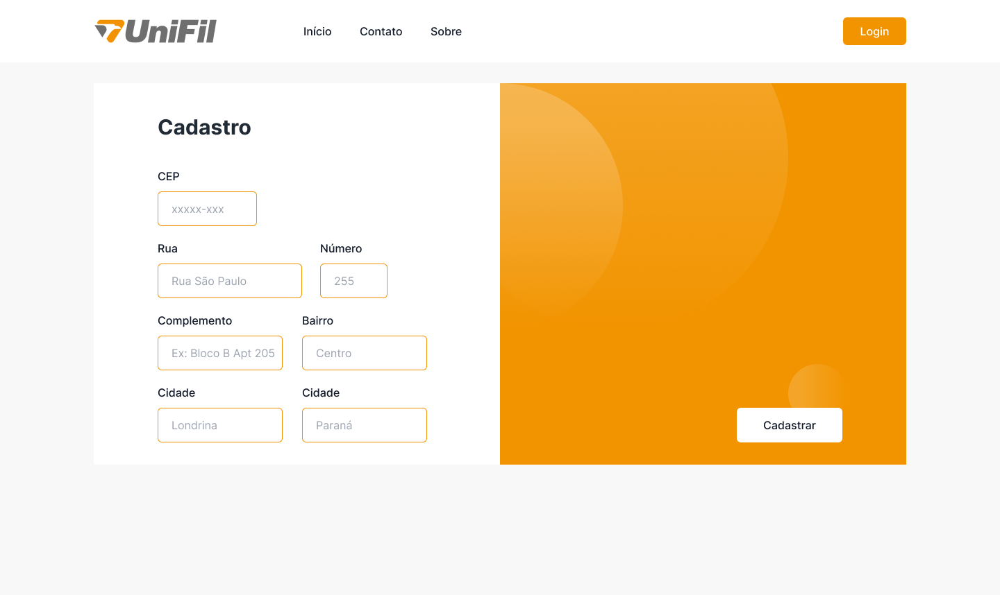
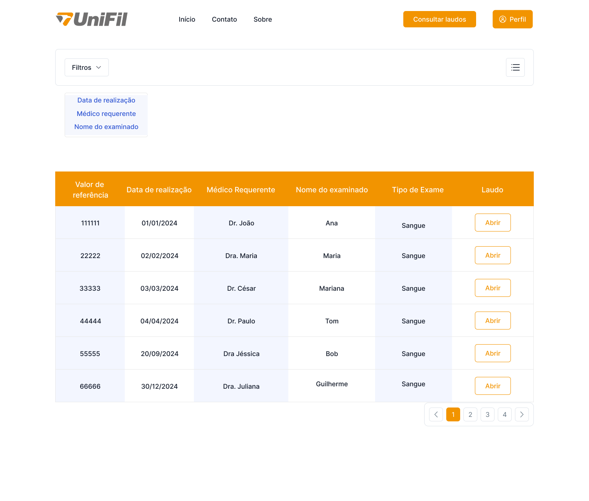
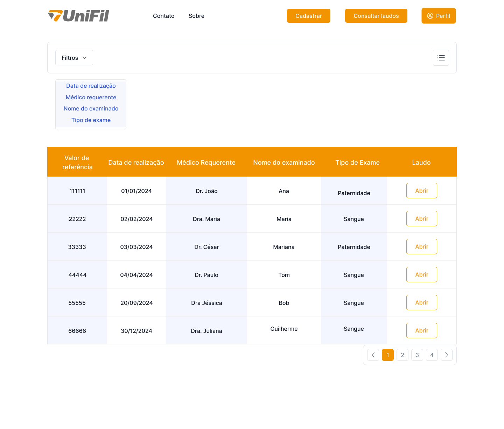

# Telas

## Tela inicial sem login

## Tela de login

## Tela de cadastro 1

## Tela de cadastro 2

## Tela inicial logado como recepcionista

## Tela inicial logado como coordenador(a)

## Tela inicial logado como biomédico(a) ou como paciente

## Consultar laudos como biomédico(a)

## Consultar laudos como Coordenador(a)

## Consultar laudos como Paciente

[Voltar](readme.md)
