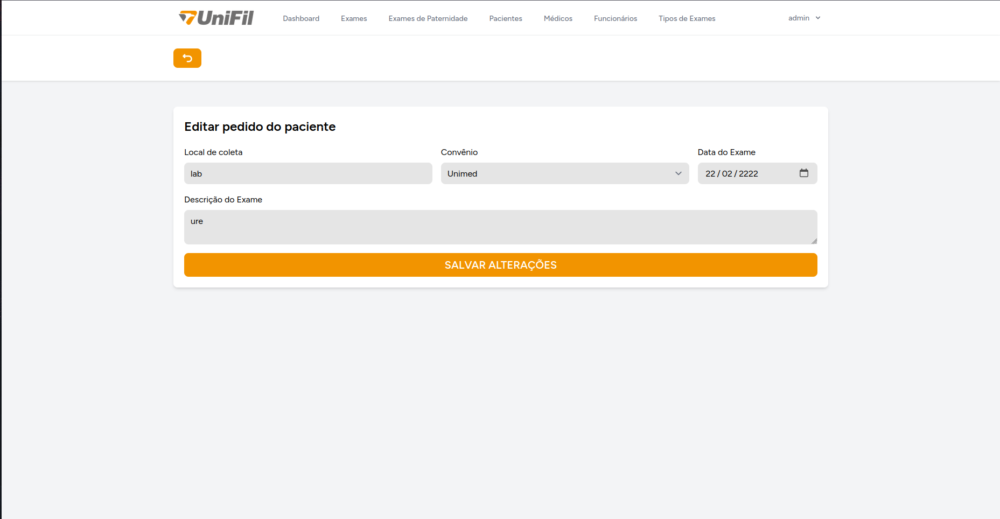
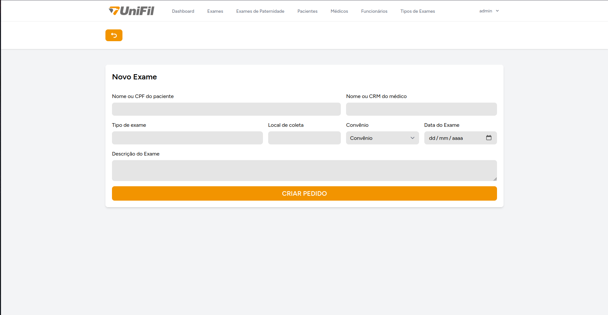
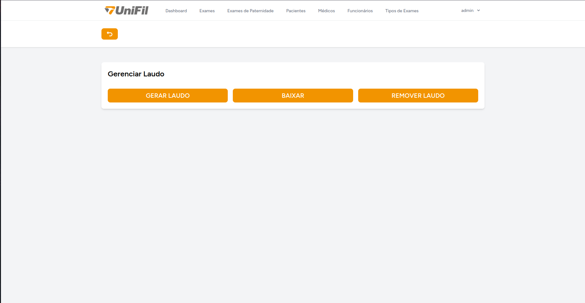
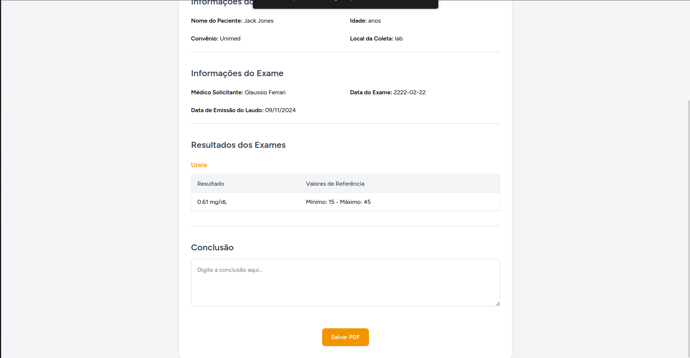
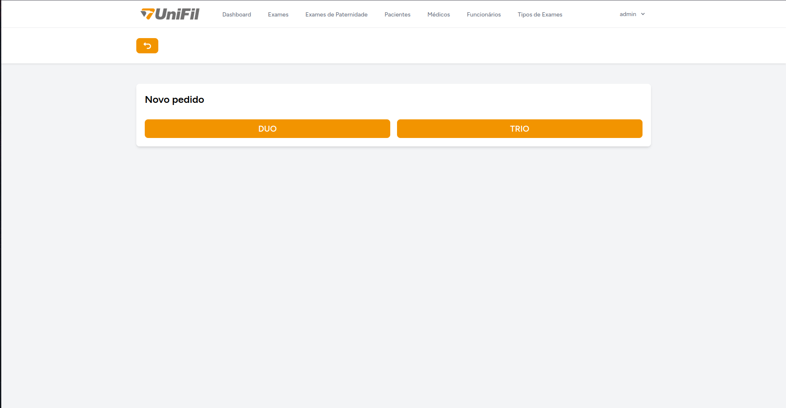
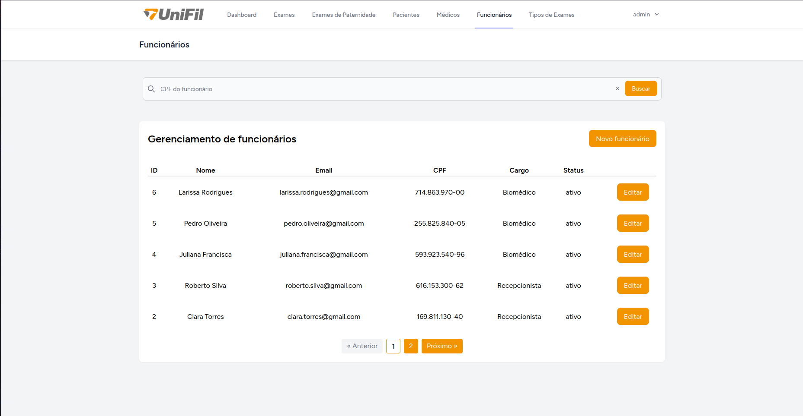
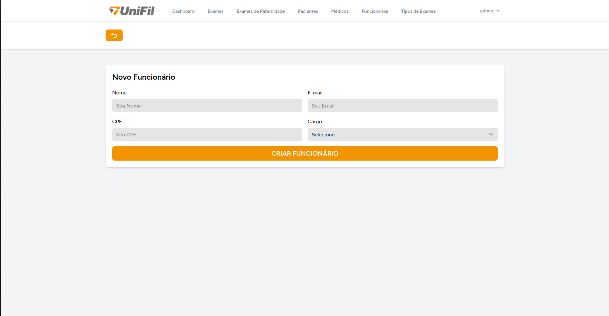
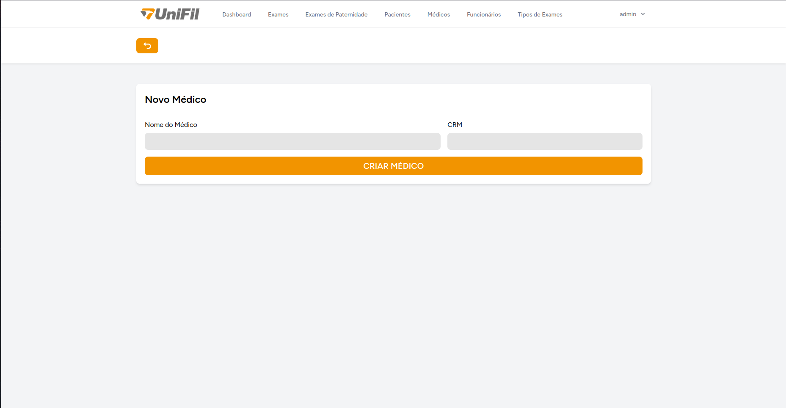

# Telas

## Inicial

A Figura 1 é a tela inicial do sistema.

Figura 1

## Login

A Figura 2 é a tela de login do sistema.

Figura 2

## Dashboard

A Figura 3 é a sucessora do login, mostra os laudos mais recentes cadastrados.

Figura 3

## Perfil

A Figura 4 é reponsável pela troca de senha da própria conta.

Figura 4

## Exames de sangue

### Index

A Figura 5 é onde é exibido os pedidos dos exames de sangue.

Figura 5

### Edit

A Figura 6 é responsável pela edição do pedido.

Figura 6

### Create

A Figura 7 é responsável pela criação do pedido.

Figura 7

### Gerenciar laudos

A Figura 8 é responsável pelo gerenciamento do laudo.

Figura 8

### Imortar CSV

A Figura 9 é onde ocorre a importação do arquivo CSV.

Figura 9

### Preview PDF

As Figuras 10 e 11 mostram o preview do PDF.

Figura 10

Figura 11

## Exames de paternidade

### Index

A Figura 12 é responsável por exibir os pedidos dos exames de paternidade.

Figura 12

### Edit

A Figura 13 é responsável por editar os pedidos.

Figura 13

### Select

A Figura 14 é responsável por selecionar o tipo de teste de paternidade que deseja criar o pedido.

Figura 14

### Create

As Figuras 15 e 16 são responsáveis por criar os exames de duo e trio.

Figura 15

Figura 16

### Gerenciar laudos

A Figura 17 é responsável por gerenciar os laudos do exame de paternidade.

Figura 17

### Inserir dados do exame

As Figuras 18, 19, 20 e 21 são responsáveis pela inserção dos dados para geração do laudo de paternidade.

Figura 18

Figura 19

Figura 20

Figura 21

### Preview PDF

As Figuras 22 e 23 exibem preview do PDF.

Figura 22

Figura 23

## Funcionários

### Index

A Figura 24 é responsável por exibir os funcionários cadastrados.

Figura 24

### Edit

A Figura 25 é responsável por editar os dados dos funcionários cadastrados.

Figura 25

### Create

A Figura 26 é responsável por criar novos cadastros de funcionário.

Figura 26

## Médicos

### Index

A Figura 27 é responsável por exibir os médicos cadastrados.

Figura 27

### Edit

A Figura 28 é responsável por editar os dados dos médicos cadastrados.

Figura 28

### Create

A Figura 29 é responsável por criar novos cadastros de médico.

Figura 29

## Pacientes

### Index

A Figura 30 é responsável por exibir os pacientes cadastrados.

Figura 30

### Edit

A Figura 31 é responsável por editar os dados dos pacientes cadastrados.

Figura 31

### Create

A Figura 32 é responsável por criar novos cadastros de paciente.

Figura 32

## Tipos de exame

### Index

A Figura 33 é responsável por exibir os tipos de exame cadastrados.

Figura 33

### Edit

A Figura 34 é responsável por editar os dados dos tipos de exame cadastrados.

Figura 34

### Create

A Figura 35 é responsável por criar novos cadastros de tipos de exame.

Figura 35

---

[Voltar](README.md)
